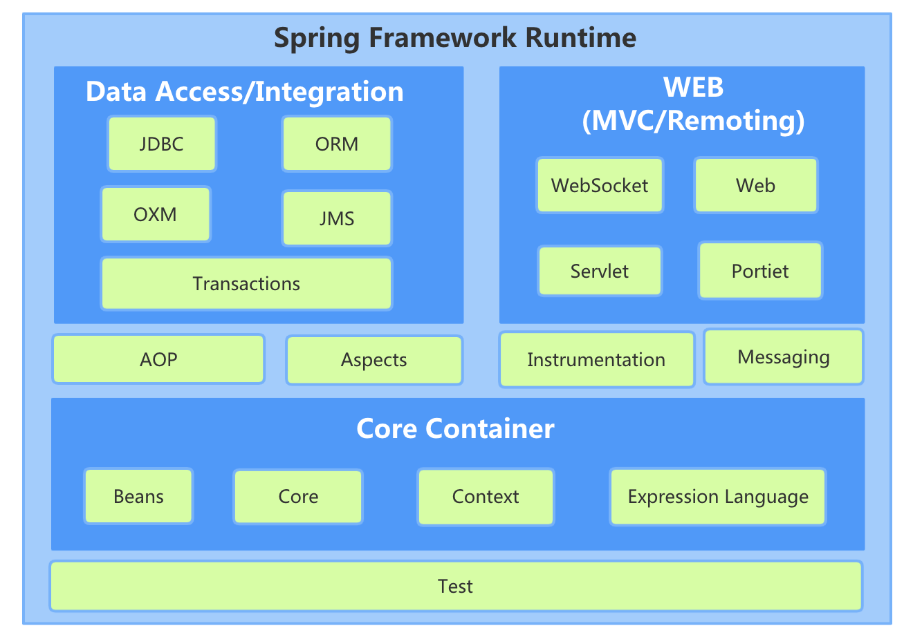

# Spring架构和环境搭建

## spring整体架构
Spring架构是一个分层架构，包含一系列功能，并被分为大约20个模块


**Core Container**  
Core Container 包含Beans、Core、Context、Expression Language模块。Core和Beans是架构的基础部分提供控制反转和依赖注入特性。这里的基础概念
是BeanFactory，提供Factory模式的经典实现来消除对程序性单例模式的需要，并真正从程序逻辑中分离出依赖关系和配置

- Core模块主要包含Spring框架基本的核心工具类，Core模块是其它组件的基本核心

- Bean模块是所有应用都要用到的，它包含访问配置文件、创建和管理Bean及进行控制反转（IOC）和依赖注入（DI）相关操作的所有类

- Context模块构建于Core和Beans模块基础之上，提供一种类似于JNDI注册器的架构式的对象访问方法。Context模块继承Bean的特性，
为Spring提供大量扩展，添加对国际化、事件传播、资源加载和对Context的透明创建的支持。Context模块同时也支持J2EE的一些特性，例如
EJB、JMX和基础的远程处理。ApplicationContext接口是Context模块的关键

- Expression Language模块提供一个强大的表达式语言用于运行时查询和操作对象。它是JSP2.0规范中定义的unifed expression language的一个扩展。
该语言支持设置/获取属性的值，属性的分配，方法的调用，访问数组上下文、容器和索引器、逻辑和算术运算、命名变量已经根据对象名从spring IOC容器中检索对象。
也支持list投影、选择和list聚合

**Data Access/Integration**
Data Access/Integration 包含JDBC、ORM、OXM、JMS和Transaction模块

- JDBC模块提供了一个JDBC抽象层，可以消除冗长的JDBC编码和解析数据库厂商特有的错误代码，这个模块包含了spring对JDBC包装的所有类

- ORM模块为流行的对象-关系映射API，如JPA、JDO、Hibernate、iBatis等，提供了一个交互层。利用ORM封装包可以混合使用所有Spring提供
的特性进行O/R映射

- OXM提供对Object/XML映射实现的抽象层，Object/XML映射实现包括JAXB、Castor、XMLBeans、JiBX和XStream

- JMS模块主要包含一些制造和消费消息的特性

- Transaction模块支持编程和声明性的事务管理，这些事务类必须实现特定接口，并对所有POJO都适用

**Web**
Web上下文模块建立在应用程序上下文之上，为基于Web应用程序提供了上下文。Web层包含WebSocket、Web、Servlet、portlet模块

- Web模块提供基础的面向Web的集成特性，如多文件上传，使用Servlet Listeners初始化Ioc容器以及一个面向Web的应用上下文。还包含spring远程支持中Web
相关部分

- Web-Servlet模块包含spring的model-view-controller(MVC)实现。Spring的MVC框架使得模型范围内的代码和Web forms之间能够清楚的分离开，并与Spring
框架的其他特性集成在一起

- Web-Struts模块提供对Struts的支持，使得Spring应用中能与一个典型的Struts Web层集成在一起。该支持在spring3.0是deprecated

- Web-Portlet模块提供Portlet环境和Web-Servlet模块的MVC实现

**AOP**

AOP模块提供了一个符合AOP联盟标准的面向切面编程的实现，它可以让你定义例如方法拦截器和切点，从而可以将逻辑代码分开，降低代码的耦合性

通过配置管理特性，Spring AOP模块直接将面向切面编程功能集成到Spring框架中，可以很容易使用Spring框架管理的对象支持AOP。Spring AOP模块为基于Spring
的应用程序中的对象提供了事务管理服务。通过使用Spring AOP，不用依赖EJB组件，就可以将声明性事务管理集成到应用程序中
- Aspects模块提供了对AspectJ的集成支持
- Instrumentation提供了class instrumentation支持和classloader实现，使得可以在特定的应用服务器上使用

**Test**

Test模块支持使用JUnit和TestNG对Spring组件进行测试

## 环境搭建

### 安装Gradle

对于macOS可以直接使用brew安装
```
brew install gradle
```

### 下载spring

Spring源码通过GitHub管理，使用以下命令拉取
```
git clone https://github.com/spring-projects/spring-framework.git
```