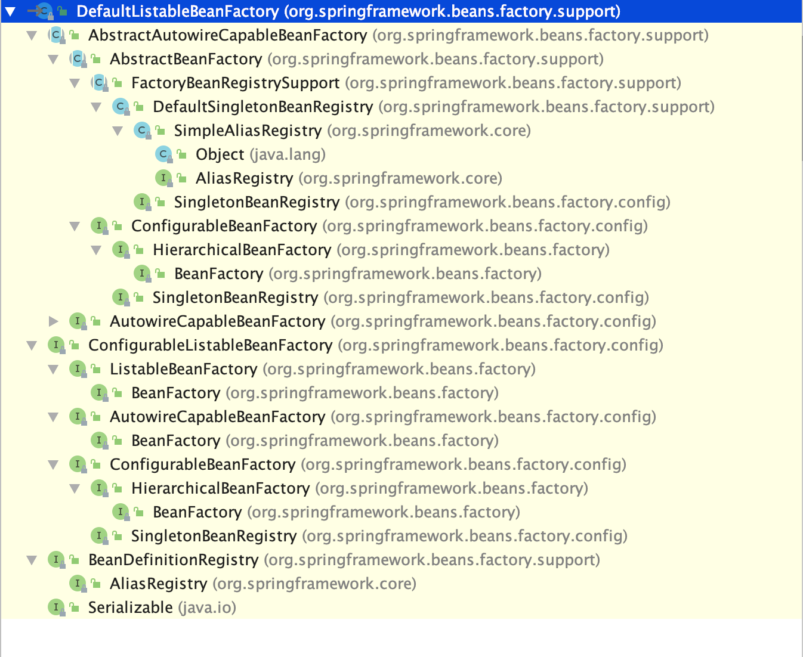
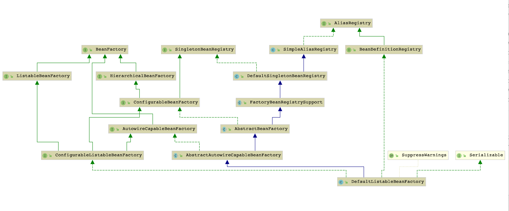
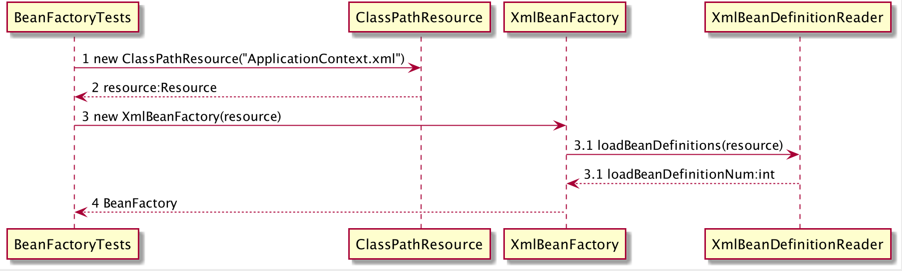
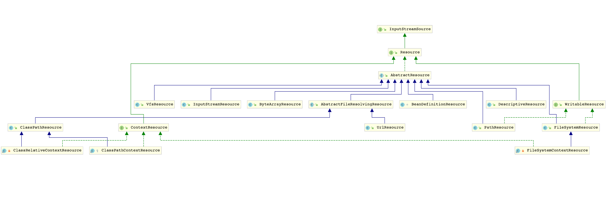
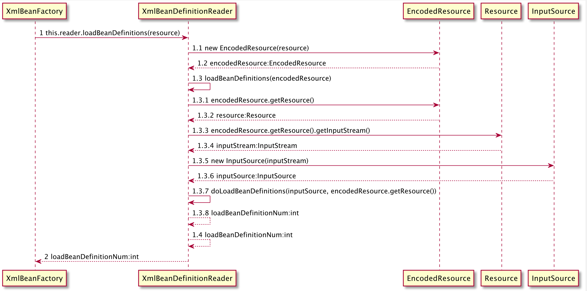

# 容器的基本实现

## Spring的结构组成

### bean包的层级结构

beans包中各个源码包的功能如下

- src/main/java用于展现Spring的主要逻辑

- src/main/resource用于存放系统的配置文件

- src/test/java用于对主要逻辑进行单元测试

- src/test/resource用于存放测试用的配置文件

### 核心类介绍

Spring中最为核心的两个类

#### DefaultListableBeanFactory

XmlBeanFactory继承自org.springframework.beans.factory.support.DefaultListableBeanFactory，DefaultListableBeanFactory是整个bean
加载的核心部分，是Spring注册及加载bean的默认实现，对于XmlBeanFactory与DefaultListableBeanFactory不同的地方在于XmlBeanFactory中使用了自定义
的XML读取器XmlBeanDefinitionReader，实现个性化的BeanDefinitionReader读取，DefaultListableBeanFactory
继承了AbstractAutowireCapableBeanFactory，并实现了ConfigurableListableBeanFactory以及BeanDefinitionRegistry接口





从上面的类图及层次结构图中，可以很清楚的从全局角度了解DefaultListableBeanFactory的脉络

- AliasRegistry： 定义对alias简单的增删改查等操作

- SimpleAliasRegistry：主要使用map作为alias的缓存，并对接口AliasRegistry进行实现

- SingletonBeanRegistry：定义对单例的注册及获取

- BeanFactory：定义获取bean及bean的各种属性

- DefaultSingletonBeanRegistry：定义对接口SingletonBeanRegistry各函数的实现

- HierarchicalBeanFactory：继承BeanFactory，增加对parentFactory支持

- BeanDefinitionRegistry：定义BeanDefinition的各种增删改操作

- FactoryBeanRegistrySupport：在DefaultSingletonBeanRegistry基础上增加了对FactoryBean的特殊处理功能

- ConfigurableBeanFactory：提供配置Factory的各种方法

- ListableBeanFactory：根据各种条件获取bean的配置清单

- AbstractBeanFactory：综合FactoryBeanRegistrySupport和ConfigurableBeanFactory的功能

- AutowireCapableBeanFactory：提供创建bean、自动注入、初始化及应用bean的后处理器

- AbstractAutowireCapableBeanFactory：综合AbstractBeanFactory并对接口AutowireCapableBeanFactory进行实现

- ConfigurableListableBeanFactory：BeanFactory配置清单，指定忽略类型及接口等

- DefaultListableBeanFactory：综合上面所有功能，主要是对Bean注册后的处理

XmlBeanFactory对DefaultListableBeanFactory类进行扩展，主要用于从XML文档中读取BeanDefinition，对于注册及获取Bean都是通过父类DefaultListableBeanFactory
继承的方法实现，而唯独与父类不同的是增加了类型为XmlBeanDefinitionReader的reader属性。在XmlBeanFactory中主要通过reader对资源属性进行读取和注册

#### XmlBeanDefinitionReader

XML配置文件的读取是Spring中重要的功能，因为Spring的大部分功能都是以配置作为切入点，可以从XmlBeanDefinitionReader中梳理一下资源文件读取、解析及 注册的大致脉络

- ResourceLoader：定义资源加载器，主要应用于根据给定的资源文件地址返回对应的Resource
- BeanDefinitionReader：主要定义资源文件读取并转换为BeanDefinition的各个功能
- EnvironmentCapable：定义获取Environment
- DocumentLoader：定义从资源文件加载到转换为Document的功能
- AbstractBeanDefinitionReader：对EnvironmentCapable、BeanDefinitionReader类定义的功能进行实现
- BeanDefinitionDocumentReader：定义读取Document并注册BeanDefinition功能
- BeanDefinitionParserDelegate：定义解析Element的各种方法

整个XML配置文件读取的大致流程如下

- 通过继承自AbstractBeanDefinitionReader中的方法，使用ResourceLoader将资源文件路径转换为对应的Resource文件
- 通过DocumentLoader对Resource文件进行转换，将Resource文件转换为Document文件
- 通过实现接口BeanDefinitionDocumentReader的DefaultBeanDefinitionDocumentReader类对Document进行解析，并使用BeanDefinitionParserDelegate
  对Element进行解析

## 容器的基础XmlBeanFactory

BeanFactory bf = new XmlBeanFactory(new ClassPathResource("beanFactoryTest.xml"));

通过XmlBeanFactory初始化时序图了解上面代码执行逻辑


时序图从BeanFactoryTests测试类开始，通过时序图我们可以看到整个逻辑处理顺序，首先调用ClassPathResource的构造函数构造
resource资源对象实例，之后的资源处理就可以使用Resource提供的各种服务，有了Resource就可以进行XmlBeanFactory的初始化

### 配置文件封装

Spring 的配置文件读取是通过ClassPathResource进行分装。java中将不同来源的资源抽象成URL，通过注册不同的handler来处理不同来源的资源的读取逻辑， 一般handler的类型使用不同前缀来识别，如"file:"
、"http:"、"jar:"等，然而URL没有默认定义相对ClassPath或ServletContext等资源的handler，虽然
可以定义自己的handler注册到URL来解析特定类型的资源，但URL并未提供检查资源是否存在、是否可读等方法。因而Spring对其内部使用到的资源实现了自己的抽象 结构：Resource接口来封装底层资源

```java
    public interface InputStreamSource {
    InputStream getInputStream() throws IOException;

}

public interface Resource extends InputStreamSource {

    boolean exists();

    boolean isReadable();

    boolean isOpen();

    URL getURL() throws IOException;

    URI getURI() throws IOException;

    File getFile() throws IOException;

    long contentLength() throws IOException;

    long lastModified() throws IOException;

    Resource createRelative(String relativePath) throws IOException;

    String getFilename();

    String getDescription();
}
```

InputStream分装任何能返回InputStream的类，如File、Classpath下的资源和Byte Arry等,并只有一个getInputStream方法，返回一个新的InputStream对象

Resource接口抽象了所有Spring内部使用到的底层资源：File、URL、Classpath等，其定义了3个判断当前资源状态的方法：存在性、可读性、是否处于打开状态，
还提供了不同资源到URL、URI、File类型的转换，以及获取lastModified属性、不带路径文件名的方法。Resource还提供了基于当前资源创建一个相对资源的方法： createRelative()
。错误处理时需要详细打印粗错的资源文件，Resource还提供了getDescription()方法用于在错误处理中打印信息

对不同来源的资源文件都有相应的Resource实现：文件（FileSystemResource）、Classpath资源（ClassPathResource）、URL资源（URLResource）、
InputStream资源（InputStreamResource）、Byte数组（ByteArrayResource）等


在平时开发中也可以使用spring提供的Resource完成资源的读取

```java
    Resource resource=new ClassPathResource("beanFactoryTest.xml");
        InputStream inputstream=resource.getInputStream();
```

有了Resource接口我们就可以对所有资源文件进行统一处理。getInputStream()实现方式是通过class或classLoader提供的底层方法getResourceAsStream
获取文件流，FileSystemResource实现获取文件流更简单，直接使用FileInputStream对文件进行实例化

```java
@Override
public InputStream getInputStream()throws IOException{
        InputStream is;
        if(this.clazz!=null){
        is=this.clazz.getResourceAsStream(this.path);
        }
        else{
        is=this.classLoader.getResourceAsStream(this.path);
        }
        if(is==null){
        throw new FileNotFoundException(getDescription()+" cannot be opened because it does not exist");
        }
        return is;
        }

@Override
public InputStream getInputStream()throws IOException{
        return new FileInputStream(this.file);
        }
```

当通过Resource相关类完成对配置文件进行封装后配置文件的读取工作就全权交由XmlBeanDefinitionReader来处理。XmlBeanFactory的初始化有若干
方法，此处我们讨论的是使用Resource实例作为构造函数参数的方式初始化

```java
public XmlBeanFactory(Resource resource)throws BeansException{
        this(resource,null);
        }

public XmlBeanFactory(Resource resource,BeanFactory parentBeanFactory)throws BeansException{
        super(parentBeanFactory);
        this.reader.loadBeanDefinitions(resource);
        }
```

上面函数中的代码this.reader.loadBeanDefinitions(resource)才是资源加载的真正实现，在XmlBeanDefinition加载数据前还有一个调用父类构造 函数初始化的过程：super(
parentBeanFactory)，跟踪代码到父类AbstractAutowireCapableBeanFactory构造函数代码如下

```java
public AbstractAutowireCapableBeanFactory(){
        super();
        ignoreDependencyInterface(BeanNameAware.class);
        ignoreDependencyInterface(BeanFactoryAware.class);
        ignoreDependencyInterface(BeanClassLoaderAware.class);
        }
```

ignoreDependencyInterface的主要功能是忽略给定接口的自动装配功能。当A中有属性B，那么当Spring在获取A的Bean时，如果其属性B还没有初始化，
那么Spring会自动初始化B，这也是Spring中提供的一个重要特性。但在某些情况下B不会初始化，其中一种情况是B实现了BeanNameAware接口。spring
官网描述如下：自动装配时忽略给定依赖接口，典型应用是通过其他方式解析Application上下文注册依赖，类似于BeanFactory通过BeanFactoryAware
进行注入或者ApplicationContext通过ApplicationContextAware进行注入

### 加载Bean

之前提到在XmlBeanFactory构造函数中调用XmlBeanDefinitionReader类型的reader属性提供的方法this.reader.loadBeanDefinition(resource),
此代码便是整个资源加载的切入点，时序图如下

上面时序图处理过程如下

- 封装资源文件：进入XmlBeanDefinitionReader后首先对参数Resource使用EncodedResource进行封装
- 获取输入流：从Resource中获取对应的InputStream并构造InputSource
- 通过构造的InputSource实例和Resource实例继续调用doLoadBeanDefinitions

loadBeanDefinition函数具体实现过程如下

```java
@Override
public int loadBeanDefinitions(Resource resource)throws BeanDefinitionStoreException{
        return loadBeanDefinitions(new EncodedResource(resource));
        }
```

EncodedResource这个类主要是用于对资源文件的编码进行处理。主要逻辑体现在getReader()方法，当设置了编码属性Spring会使用相应的编码作为输入流 的编码

```java
public Reader getReader()throws IOException{
        if(this.charset!=null){
        return new InputStreamReader(this.resource.getInputStream(),this.charset);
        }
        else if(this.encoding!=null){
        return new InputStreamReader(this.resource.getInputStream(),this.encoding);
        }
        else{
        return new InputStreamReader(this.resource.getInputStream());
        }
        }
```

上面代码构造了一个有编码的InputStreamReader，当构造好encodeResource对象后，再次转入loadBeanDefinitions(new EncodedResource(resource))
这个方法内部才是真正的数据准备阶段

```java
public int loadBeanDefinitions(EncodedResource encodedResource)throws BeanDefinitionStoreException{
        Assert.notNull(encodedResource,"EncodedResource must not be null");
        if(logger.isInfoEnabled()){
        logger.info("Loading XML bean definitions from "+encodedResource.getResource());
        }
        //通过属性记录已经加载的资源
        Set<EncodedResource> currentResources=this.resourcesCurrentlyBeingLoaded.get();
        if(currentResources==null){
        currentResources=new HashSet<EncodedResource>(4);
        this.resourcesCurrentlyBeingLoaded.set(currentResources);
        }
        if(!currentResources.add(encodedResource)){
        throw new BeanDefinitionStoreException(
        "Detected cyclic loading of "+encodedResource+" - check your import definitions!");
        }
        try{
        InputStream inputStream=encodedResource.getResource().getInputStream();
        try{
        InputSource inputSource=new InputSource(inputStream);
        if(encodedResource.getEncoding()!=null){
        inputSource.setEncoding(encodedResource.getEncoding());
        }
        //真正核心处理逻辑
        return doLoadBeanDefinitions(inputSource,encodedResource.getResource());
        }
        finally{
        inputStream.close();
        }
        }
        catch(IOException ex){
        throw new BeanDefinitionStoreException(
        "IOException parsing XML document from "+encodedResource.getResource(),ex);
        }
        finally{
        currentResources.remove(encodedResource);
        if(currentResources.isEmpty()){
        this.resourcesCurrentlyBeingLoaded.remove();
        }
        }
        }
```

doLoadBeanDefinitions(inputSource, encodedResource.getResource())实现逻辑如下

```java
protected int doLoadBeanDefinitions(InputSource inputSource,Resource resource)
        throws BeanDefinitionStoreException{
        try{
        Document doc=doLoadDocument(inputSource,resource);
        return registerBeanDefinitions(doc,resource);
        }
        catch(BeanDefinitionStoreException ex){
        throw ex;
        }
        catch(SAXParseException ex){
        throw new XmlBeanDefinitionStoreException(resource.getDescription(),
        "Line "+ex.getLineNumber()+" in XML document from "+resource+" is invalid",ex);
        }
        catch(SAXException ex){
        throw new XmlBeanDefinitionStoreException(resource.getDescription(),
        "XML document from "+resource+" is invalid",ex);
        }
        catch(ParserConfigurationException ex){
        throw new BeanDefinitionStoreException(resource.getDescription(),
        "Parser configuration exception parsing XML from "+resource,ex);
        }
        catch(IOException ex){
        throw new BeanDefinitionStoreException(resource.getDescription(),
        "IOException parsing XML document from "+resource,ex);
        }
        catch(Throwable ex){
        throw new BeanDefinitionStoreException(resource.getDescription(),
        "Unexpected exception parsing XML document from "+resource,ex);
        }
        }

protected Document doLoadDocument(InputSource inputSource,Resource resource)throws Exception{
        return this.documentLoader.loadDocument(inputSource,getEntityResolver(),this.errorHandler,
        getValidationModeForResource(resource),isNamespaceAware());
        }
```

上面代码一共做了三件事情

- 获取对XML文件的验证模式

- 加载XMl文件，得到对应的Document

- 根据返回的Document组册Bean信息

## 获取XML的验证模式

XML文件的验证模式保证了XML文件的正确性，比较常见的认证模式有两种：DTD和XSD

### DTD与XSD区别

DTD即文档类型定义，是一种XML约束模式语言，是XML文件的验证机制，属于XML文件组成的一部分。DTD是一种保证XML文档格式正确的有效方法，可以通过
比较XML文档和DTD文件来看文档是否符合规范，元素和标签使用是否正确。一个DTD文档包含：元素的定义规整、元素间关系的定义规则、元素可使用属性、 可使用的实体或符号规范

要使用DTD验证模式需要在XML文件头部声明，以下是Spring中使用DTD声明方式

```xml
<?xml version="1.0"encoding="UTF-8"?>
<!DOCTYPE beans PUBLIC"-//Spring//DTD BEAN 2.0//EN""http://www.springframework.org/dtd/spring-beans-2.0.dtd">
<beans>
    ....
</beans>
```

具体的Spring-beans-2.0.dtd部分如下

```java
<!ELEMENT beans(
        description?,
        (import |alias|bean)*
        )>

<!--
        Default values for all bean definitions.Can be overridden at
        the"bean"level.See those attribute definitions for details.
        -->
<!ATTLIST beans default-lazy-init(true|false)"false">
<!ATTLIST beans default-autowire(no|byName|byType|constructor|autodetect)"no">
<!ATTLIST beans default-dependency-check(none|objects|simple|all)"none">
<!ATTLIST beans default-init-method CDATA #IMPLIED>
<!ATTLIST beans default-destroy-method CDATA #IMPLIED>
<!ATTLIST beans default-merge(true|false)"false">
        ...........
```

XML Schema语言就是XSD。XML Schema描述XML文档的结构，可以用一个指定的XML Schema来验证某个XML文档，以检查XML文档是否符合要求。文档设计者 可以通过XML
Schema指定一个XML所允许的结构和内容，并可据此检查XML文档是否有效，XML Schema本身是一个XML文档，可用通用的XML解析器解析它

使用XML Schema文档对XML实例文档进行校验，除了要声明名称空间xmlns="http://www.springframework.org/schema/beans"外，还必须指定该名称
空间所对应XML Schema文档的存储位置。通过schemaLocation属性来指定名称空间XML Schema文档的位置，包含两个部分，一部分是名称空间的URI，另 一部分就是该名称空间所标识的XML
Schema文件位置或URL地址（http://www.springframework.org/schema/beans
http://www.springframework.org/schema/beans/spring-beans.xsd）

```xml
<?xml version="1.0"encoding="UTF-8"?>
<beans xmlns="http://www.springframework.org/schema/beans"
       xmlns:xsi="http://www.w3.org/2001/XMLSchema-instance"
       xsi:schemaLocation="http://www.springframework.org/schema/beans
        http://www.springframework.org/schema/beans/spring-beans.xsd">
    <bean id="myTestBean" class="org.aim.spring.domain.entity.MyTestBean"/>
</beans>
```

spring-beans.xsd部分代码如下

```xml

<xsd:schema xmlns="http://www.springframework.org/schema/beans" xmlns:xsd="http://www.w3.org/2001/XMLSchema"
            targetNamespace="http://www.springframework.org/schema/beans">
    <xsd:import namespace="http://www.w3.org/XML/1998/namespace"/>
    <xsd:annotation>
        <xsd:documentation>
            <![CDATA[ Spring XML Beans Schema, version 4.3 Authors: Juergen Hoeller, Rob Harrop, Mark Fisher, Chris Beams This defines a simple and consistent way of creating a namespace of JavaBeans objects, managed by a Spring BeanFactory, read by XmlBeanDefinitionReader (with DefaultBeanDefinitionDocumentReader). This document type is used by most Spring functionality, including web application contexts, which are based on bean factories. Each "bean" element in this document defines a JavaBean. Typically the bean class is specified, along with JavaBean properties and/or constructor arguments. A bean instance can be a "singleton" (shared instance) or a "prototype" (independent instance). Further scopes can be provided by extended bean factories, for example in a web environment. References among beans are supported, that is, setting a JavaBean property or a constructor argument to refer to another bean in the same factory (or an ancestor factory). As alternative to bean references, "inner bean definitions" can be used. Such inner beans do not have an independent lifecycle; they are typically anonymous nested objects that share the scope of their containing bean. There is also support for lists, sets, maps, and java.util.Properties as bean property types or constructor argument types. ]]>
        </xsd:documentation>
    </xsd:annotation>
    ............
</xsd:schema>
```

### 验证模式的读取

了解了DTD与XSD的区别后，我们来看一下Spring通过getValidationModeForResource方法来获取对应资源的验证模式

```java
protected int getValidationModeForResource(Resource resource){
        int validationModeToUse=getValidationMode();
        //如果手动指定了验证模式则使用指定的验证模式
        if(validationModeToUse!=VALIDATION_AUTO){
        return validationModeToUse;
        }
        //如果未指定则使用自动检测
        int detectedMode=detectValidationMode(resource);
        if(detectedMode!=VALIDATION_AUTO){
        return detectedMode;
        }
        // Hmm, we didn't get a clear indication... Let's assume XSD,
        // since apparently no DTD declaration has been found up until
        // detection stopped (before finding the document's root tag).
        return VALIDATION_XSD;
        }
```

如果设定了验证模式则使用设定的验证模式（可以通过XmlBeanDefinitionReader中的setValidationMode方法设置），否则使用自动检查方式。自动检测
的方式在函数detectValidationMode方法中实现，在detectValidationMode函数中又将自动检测验证模式的工作委托给了专门的处理类XmlValidationModeDetector
的detectValidationMode方法

```java
protected int detectValidationMode(Resource resource){
        if(resource.isOpen()){
        throw new BeanDefinitionStoreException(
        "Passed-in Resource ["+resource+"] contains an open stream: "+
        "cannot determine validation mode automatically. Either pass in a Resource "+
        "that is able to create fresh streams, or explicitly specify the validationMode "+
        "on your XmlBeanDefinitionReader instance.");
        }

        InputStream inputStream;
        try{
        inputStream=resource.getInputStream();
        }
        catch(IOException ex){
        throw new BeanDefinitionStoreException(
        "Unable to determine validation mode for ["+resource+"]: cannot open InputStream. "+
        "Did you attempt to load directly from a SAX InputSource without specifying the "+
        "validationMode on your XmlBeanDefinitionReader instance?",ex);
        }

        try{
        return this.validationModeDetector.detectValidationMode(inputStream);
        }
        catch(IOException ex){
        throw new BeanDefinitionStoreException("Unable to determine validation mode for ["+
        resource+"]: an error occurred whilst reading from the InputStream.",ex);
        }
        }

public int detectValidationMode(InputStream inputStream)throws IOException{
        // Peek into the file to look for DOCTYPE.
        BufferedReader reader=new BufferedReader(new InputStreamReader(inputStream));
        try{
        boolean isDtdValidated=false;
        String content;
        while((content=reader.readLine())!=null){
        content=consumeCommentTokens(content);
        //如果读取的行是空或注释则掠过
        if(this.inComment||!StringUtils.hasText(content)){
        continue;
        }
        if(hasDoctype(content)){
        isDtdValidated=true;
        break;
        }
        if(hasOpeningTag(content)){
        // End of meaningful data...
        break;
        }
        }
        return(isDtdValidated?VALIDATION_DTD:VALIDATION_XSD);
        }
        catch(CharConversionException ex){
        // Choked on some character encoding...
        // Leave the decision up to the caller.
        return VALIDATION_AUTO;
        }
        finally{
        reader.close();
        }
        }
```

Spring用来检测验证模式的办法就是判断是否包含DOCTYPE，如果包含就是DTD，否则就是XSD

## 获取Document

获取验证模式之后开始加载Document，XmlBeanFactoryReader将加载Document工作交由DocumentLoader执行，这里DocumentLoader是一个接口，真正
调用的是DefaultDocumentReader

```java
@Override
public Document loadDocument(InputSource inputSource,EntityResolver entityResolver,
        ErrorHandler errorHandler,int validationMode,boolean namespaceAware)throws Exception{

        DocumentBuilderFactory factory=createDocumentBuilderFactory(validationMode,namespaceAware);
        if(logger.isDebugEnabled()){
        logger.debug("Using JAXP provider ["+factory.getClass().getName()+"]");
        }
        DocumentBuilder builder=createDocumentBuilder(factory,entityResolver,errorHandler);
        return builder.parse(inputSource);
        }
```

通过SAX解析XML文档的套路大致都差不多，首先创建DocumentBuilderFactory，在通过DocumentBuilderFactory创建DocumentBuilder，进而解析
inputSource返回Document对象。通过getEntityResolver()函数返回entityResolver

```java
protected EntityResolver getEntityResolver(){
        if(this.entityResolver==null){
        // Determine default EntityResolver to use.
        ResourceLoader resourceLoader=getResourceLoader();
        if(resourceLoader!=null){
        this.entityResolver=new ResourceEntityResolver(resourceLoader);
        }
        else{
        this.entityResolver=new DelegatingEntityResolver(getBeanClassLoader());
        }
        }
        return this.entityResolver;
        }
```

### EntityResolver用法

在loadDocument方法中涉及一个参数EntityResolver，官方的解释是：如果SAX应用程序需要实现自定义处理外部实体，则必须实现此结口并使用setEntityResolver
方法向SAX驱动注册一个实体。也就是说，对于一个XML，SAX首先读取该XML文档上的声明，根据声明去寻找相应的DTD定义，以便对文档进行验证。默认寻址规则 通过网络即声明的DTD的URI地址来下载相应的DTD声明，并认证

EntityResolver的作用就是项目本身能提供一个如何寻找DTD声明的方法，有程序实现寻找DTD声明的过程，如将DTD文档放在项目中，在实现时直接将文档 读取并返回给SAX，以避免网络可能的中断或超时等情况

entityResolver接口方法声明

```java
 public abstract InputSource resolveEntity(String publicId,
        String systemId)
        throws SAXException,IOException;
        }
```

此方法接收两个参数publicId和systemId，并返回一个InputSource对象

如果我们在解析验证模式是XSD的文件

```xml
<?xml version="1.0"encoding="UTF-8"?>
<beans xmlns="http://www.springframework.org/schema/beans"
       xmlns:xsi="http://www.w3.org/2001/XMLSchema-instance"
       xsi:schemaLocation="http://www.springframework.org/schema/beans
        http://www.springframework.org/schema/beans/spring-beans.xsd">
    <bean id="myTestBean" class="org.aim.spring.domain.entity.MyTestBean"/>
</beans>
```

读取到以下两个参数

- publicId：null

- systemId：http://www.springframework.org/schema/beans/spring-beans.xsd

如果解析验证模式是DTD的配置文件

```xml
<?xml version="1.0"encoding="UTF-8"?>
<!DOCTYPE beans PUBLIC "-//Spring//DTD BEAN 2.0//EN" "http://www.springframework.org/dtd/spring-beans-2.0.dtd">
<beans>
    ....
</beans>
```

读取到以下两个参数

- publicId：-//Spring//DTD BEAN 2.0//EN

- systemId：http://www.springframework.org/dtd/spring-beans-2.0.dtd

验证文件的默认加载方式是通过URL进行网络下载，但这样会造成延迟，用户体验不好，一般做法是将验证文件放置在自己工程里。以加载DTD文件为例看Spring 是如何操作。Spring中通过getEntityResolver()
方法对EntityResolver获取，Spring中使用DelegatingEntityResolver类为EntityResolver的实现 类，resolverEntity方法如下

```
@Override
public InputSource resolveEntity(String publicId,String systemId)throws SAXException,IOException{
  if(systemId!=null){
     if(systemId.endsWith(DTD_SUFFIX)){
        return this.dtdResolver.resolveEntity(publicId,systemId);
      }
     else if(systemId.endsWith(XSD_SUFFIX)){
        return this.schemaResolver.resolveEntity(publicId,systemId);
     }
  }
  return null;
}
```

对不同的验证模式，Spring使用了不同的解析器解析。加载DTD类型的BeansDtdResolver的resolverEntity是直接截取systemId最后的xx.dtd
然后去当前路径下寻找；加载XSD类型的PluggableSchemaResolver类的resolverEntity默认到META-INF/Spring.schemas文件中查找systemId所对 应的XSD文件并加载

```
// BeansDtdResolver
public InputSource resolveEntity(String publicId, String systemId) throws IOException {
    if (logger.isTraceEnabled()) {
        logger.trace("Trying to resolve XML entity with public ID [" + publicId + "] and system ID [" + systemId + "]");
    }

    if (systemId != null && systemId.endsWith(".dtd")) {
        int lastPathSeparator = systemId.lastIndexOf("/");
        String[] var4 = DTD_NAMES;
        int var5 = var4.length;

        for(int var6 = 0; var6 < var5; ++var6) {
            String DTD_NAME = var4[var6];
            int dtdNameStart = systemId.indexOf(DTD_NAME);
            if (dtdNameStart > lastPathSeparator) {
                String dtdFile = systemId.substring(dtdNameStart);
                if (logger.isTraceEnabled()) {
                    logger.trace("Trying to locate [" + dtdFile + "] in Spring jar");
                }

                try {
                    Resource resource = new ClassPathResource(dtdFile, this.getClass());
                    InputSource source = new InputSource(resource.getInputStream());
                    source.setPublicId(publicId);
                    source.setSystemId(systemId);
                    if (logger.isDebugEnabled()) {
                        logger.debug("Found beans DTD [" + systemId + "] in classpath: " + dtdFile);
                    }

                    return source;
                } catch (IOException var12) {
                    if (logger.isDebugEnabled()) {
                        logger.debug("Could not resolve beans DTD [" + systemId + "]: not found in class path", var12);
                    }
                }
            }
        }
    }

    return null;
}

// PluggableSchemaResolver
@Override
public InputSource resolveEntity(String publicId, String systemId) throws IOException {
    if (logger.isTraceEnabled()) {
        logger.trace("Trying to resolve XML entity with public id [" + publicId +
                "] and system id [" + systemId + "]");
    }

    if (systemId != null) {
        String resourceLocation = getSchemaMappings().get(systemId);
        if (resourceLocation != null) {
            Resource resource = new ClassPathResource(resourceLocation, this.classLoader);
            try {
                InputSource source = new InputSource(resource.getInputStream());
                source.setPublicId(publicId);
                source.setSystemId(systemId);
                if (logger.isDebugEnabled()) {
                    logger.debug("Found XML schema [" + systemId + "] in classpath: " + resourceLocation);
                }
                return source;
            }
            catch (FileNotFoundException ex) {
                if (logger.isDebugEnabled()) {
                    logger.debug("Couldn't find XML schema [" + systemId + "]: " + resource, ex);
                }
            }
        }
    }
    return null;
}
```

## 解析及注册BeanDefinitions
文件转换成Document后，就是提取及注册bean，当已经拥有XML文档文件的Document实例对象后，就会进行注册bean
```
public int registerBeanDefinitions(Document doc, Resource resource) throws BeanDefinitionStoreException {
    // 使用DefaultBeanDefinitionDocumentReader实例化BeanDefinitionDocumentReader  
    BeanDefinitionDocumentReader documentReader = createBeanDefinitionDocumentReader();
    // 设置环境变量
    documentReader.setEnvironment(this.getEnvironment());
    // 在实例化BeanDefinitonReader时候会将BeanDefinitonRegistry传入，默认使用继承自DefaultListableBeanFactory的子类
    // 记录注册前BeanDefinition的加载个数
    int countBefore = getRegistry().getBeanDefinitionCount();
    //加载及注册bean
    documentReader.registerBeanDefinitions(doc, createReaderContext(resource));
    //记录本次加载的BeanDefinition个数
    return getRegistry().getBeanDefinitionCount() - countBefore;
}
```
这个方法很好的应用了面向对象中单一职责的原则，将逻辑处理委托给单一的类来处理，这个逻辑处理类就是BeanDefinitionDocumentReader。BeanDefinitionDocumentReader
是一个接口，实例化工作是在createBeanDefinitionDocumentReader()
方法中完成，BeanDefinitionDocumentReader真正的类型是DefaultBeanDefinitionDocumentReader。
registerBeanDefinitions方法的重要目的之一就是提取root，以便再次将root作为参数继续BeanDefinition的注册
```
@Override
public void registerBeanDefinitions(Document doc, XmlReaderContext readerContext) {
    this.readerContext = readerContext;
    logger.debug("Loading bean definitions");
    Element root = doc.getDocumentElement();
    doRegisterBeanDefinitions(root);
}
```
doRegisterBeanDefinitions方法是真正的开始进行解析注册bean
```
protected void doRegisterBeanDefinitions(Element root) {
    // 处理profile属性
    String profileSpec = root.getAttribute(PROFILE_ATTRIBUTE);
    if (StringUtils.hasText(profileSpec)) {
        Assert.state(this.environment != null, "Environment must be set for evaluating profiles");
        String[] specifiedProfiles = StringUtils.tokenizeToStringArray(
                profileSpec, BeanDefinitionParserDelegate.MULTI_VALUE_ATTRIBUTE_DELIMITERS);
        if (!this.environment.acceptsProfiles(specifiedProfiles)) {
            return;
        }
    }

    // Any nested <beans> elements will cause recursion in this method. In
    // order to propagate and preserve <beans> default-* attributes correctly,
    // keep track of the current (parent) delegate, which may be null. Create
    // the new (child) delegate with a reference to the parent for fallback purposes,
    // then ultimately reset this.delegate back to its original (parent) reference.
    // this behavior emulates a stack of delegates without actually necessitating one.
    //转门处理解析
    BeanDefinitionParserDelegate parent = this.delegate;
    this.delegate = createDelegate(this.readerContext, root, parent);

    // 解析前处理，留给子类实现
    preProcessXml(root);
    parseBeanDefinitions(root, this.delegate);
    // 解析后处理，留给子类实现
    postProcessXml(root);

    this.delegate = parent;
}
```
首先对profile的处理，然后进行解析，preProcessXml(root)、postProcessXml(root)由子类实现，这是模版模式的运用，如果子类在解析前后要做
处理可重写这两个方法

### profile属性的使用
在注册Bean的最开始是对PROFILE_ATTRIBUTE属性的解析，我们可以看以下profile的用法
```
<?xml version="1.0" encoding="UTF-8"?>
<beans xmlns="http://www.springframework.org/schema/beans"
       xmlns:xsi="http://www.w3.org/2001/XMLSchema-instance"
       xsi:schemaLocation="http://www.springframework.org/schema/beans
http://www.springframework.org/schema/beans/spring-beans.xsd">

    <beans profile="dev">
        <bean id="myTestBean" class="org.aim.spring.domain.entity.MyTestBean"/>
    </beans>

    <beans profile="production">

    </beans>
</beans>
```
集成到web环境中，在web.xml中加入以下代码
```
<context-param>
  <param-name>Spring.profiles.active</param-name>
  <param-value>dev</param-value>
</context-param>
```
这样我们就可以根据不同的环境切换不同的内容

程序首先获取beans节点是否定义了profile属性，如果定义了则需要到环境变量中去寻找，首先断言environment不能为空，因为profile是可以同时指定
多个的，需要程序对齐拆分，并解析每个profile是都符合环境变量中定义的，不定义则不会去走后面逻辑注册

### 解析并注册BeanDefinition
处理完profile后就会进入XML读取
```
protected void parseBeanDefinitions(Element root, BeanDefinitionParserDelegate delegate) {
    // 对bean的处理
    if (delegate.isDefaultNamespace(root)) {
        NodeList nl = root.getChildNodes();
        for (int i = 0; i < nl.getLength(); i++) {
            Node node = nl.item(i);
            if (node instanceof Element) {
                Element ele = (Element) node;
                if (delegate.isDefaultNamespace(ele)) {
                    // 对bean的处理
                    parseDefaultElement(ele, delegate);
                }
                else {
                    // 对bean的处理
                    delegate.parseCustomElement(ele);
                }
            }
        }
    }
    else {
        delegate.parseCustomElement(root);
    }
}
```
在Spring的XML配置里面有两大类Bean声明，一个是默认的
```
<bean id="myTestBean" class="org.aim.spring.domain.entity.MyTestBean"/>
```
另一类就是自定义的
```
<tx:annotation-driven />
```
这两种方法的读取解析差别非常大，如果采用Spring默认的配置，Spring自己可以完成解析，但如果是自定义，则需要用户实现一些接口及配置。对根结点
或字节点如果是默认命名空间则采用parseDefaultElement方法进行解析，否则使用delegate.parseCustomElement方法进行自定义命名空间解析。判断
是否是默认命名空间还是自定义命名空间，是通过getNamespaceURI(node)获取命名空间，并和Spring中固定的命名空间http://www.springframework.org/schema/beans进行比较，
如果一致则为默认，否则为自定义