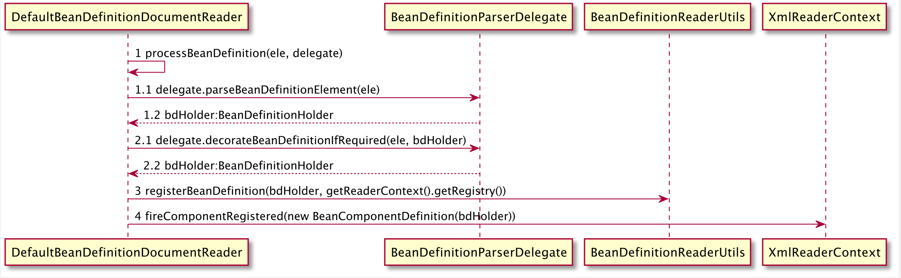

# 默认标签解析

Spring中标签包括默认标签和自定义标签两种，两种标签的用法和解析方式大不相同,默认标签的解析是在parseDefaultElement方法中进行，分别对4种 不同标签（import，alias，bean、beans）做了不同处理

```
private void parseDefaultElement(Element ele, BeanDefinitionParserDelegate delegate) {
    if (delegate.nodeNameEquals(ele, IMPORT_ELEMENT)) {
        importBeanDefinitionResource(ele);
    }
    else if (delegate.nodeNameEquals(ele, ALIAS_ELEMENT)) {
        processAliasRegistration(ele);
    }
    else if (delegate.nodeNameEquals(ele, BEAN_ELEMENT)) {
        processBeanDefinition(ele, delegate);
    }
    else if (delegate.nodeNameEquals(ele, NESTED_BEANS_ELEMENT)) {
        // recurse
        doRegisterBeanDefinitions(ele);
    }
}
```

## bean标签解析及注入

4种标签解析中，bean标签解析最复杂，我们先从bean标签解析开始分析，进入processBeanDefinition方法

```
protected void processBeanDefinition(Element ele, BeanDefinitionParserDelegate delegate) {
    BeanDefinitionHolder bdHolder = delegate.parseBeanDefinitionElement(ele);
    if (bdHolder != null) {
        bdHolder = delegate.decorateBeanDefinitionIfRequired(ele, bdHolder);
        try {
            // Register the final decorated instance.
            BeanDefinitionReaderUtils.registerBeanDefinition(bdHolder, getReaderContext().getRegistry());
        }
        catch (BeanDefinitionStoreException ex) {
            getReaderContext().error("Failed to register bean definition with name '" +
                    bdHolder.getBeanName() + "'", ele, ex);
        }
        // Send registration event.
        getReaderContext().fireComponentRegistered(new BeanComponentDefinition(bdHolder));
    }
}
```

以上代码的逻辑总结如下：

- 首先委托BeanDefinitionParserDelegate的parseBeanDefinitionElement方法进行元素解析，返回BeanDefinitionHolder类型的实例bdHolder，
  经过此方法后bdHolder实例已经包含我们配置文件中的各种属性

- bdHolder不为空的情况下若默认标签下的子节点下还有自定义属性，则还要执行自定义标签的解析

- 解析完成后，要对解析后的bdHolder进行注册，注册操作委托给了BeanDefinitionReaderUtils的registerBeanDefinition方法

- 最后发出响应事件，通知相关的监听器，这个bean已经加载完成

时序图如下:


### 解析BeanDefinition

我们先从元素解析及信息提取开始，BeanDefinitionHolder bdHolder = delegate.parseBeanDefinitionElement(ele)，进入BeanDefinitionParserDelegate
的parseBeanDefinitionElement方法

```
public BeanDefinitionHolder parseBeanDefinitionElement(Element ele) {
    return parseBeanDefinitionElement(ele, null);
}

/**
 * Parses the supplied {@code &lt;bean&gt;} element. May return {@code null}
 * if there were errors during parse. Errors are reported to the
 * {@link org.springframework.beans.factory.parsing.ProblemReporter}.
 */
public BeanDefinitionHolder parseBeanDefinitionElement(Element ele, BeanDefinition containingBean) {
    //解析id属性
    String id = ele.getAttribute(ID_ATTRIBUTE);
    //解析name属性
    String nameAttr = ele.getAttribute(NAME_ATTRIBUTE);

    //分割name属性，获取name数组
    List<String> aliases = new ArrayList<String>();
    if (StringUtils.hasLength(nameAttr)) {
        String[] nameArr = StringUtils.tokenizeToStringArray(nameAttr, MULTI_VALUE_ATTRIBUTE_DELIMITERS);
        aliases.addAll(Arrays.asList(nameArr));
    }

    String beanName = id;
    if (!StringUtils.hasText(beanName) && !aliases.isEmpty()) {
        beanName = aliases.remove(0);
        if (logger.isDebugEnabled()) {
            logger.debug("No XML 'id' specified - using '" + beanName +
                    "' as bean name and " + aliases + " as aliases");
        }
    }

    if (containingBean == null) {
        checkNameUniqueness(beanName, aliases, ele);
    }
    //解析元素构建GenericBeanDefinition对象
    AbstractBeanDefinition beanDefinition = parseBeanDefinitionElement(ele, beanName, containingBean);
    if (beanDefinition != null) {
        if (!StringUtils.hasText(beanName)) {
            try {
                // 如果不存在beanName根据Spring默认规则生成beanName
                if (containingBean != null) {
                    beanName = BeanDefinitionReaderUtils.generateBeanName(
                            beanDefinition, this.readerContext.getRegistry(), true);
                }
                else {
                    beanName = this.readerContext.generateBeanName(beanDefinition);
                    // Register an alias for the plain bean class name, if still possible,
                    // if the generator returned the class name plus a suffix.
                    // This is expected for Spring 1.2/2.0 backwards compatibility.
                    String beanClassName = beanDefinition.getBeanClassName();
                    if (beanClassName != null &&
                            beanName.startsWith(beanClassName) && beanName.length() > beanClassName.length() &&
                            !this.readerContext.getRegistry().isBeanNameInUse(beanClassName)) {
                        aliases.add(beanClassName);
                    }
                }
                if (logger.isDebugEnabled()) {
                    logger.debug("Neither XML 'id' nor 'name' specified - " +
                            "using generated bean name [" + beanName + "]");
                }
            }
            catch (Exception ex) {
                error(ex.getMessage(), ele);
                return null;
            }
        }
        String[] aliasesArray = StringUtils.toStringArray(aliases);
        return new BeanDefinitionHolder(beanDefinition, beanName, aliasesArray);
    }

    return null;
}
```

以上便是解析默认标签库的全过程，Spring解析默认标签的过程层层递进，在当前层主要完成了如下工作

- 提取元素的id及name属性

- 进一步解析其他属性并统一封装至GenericBeanDefinition对象实例中

- 如果检查到没有beanName，则使用Spring默认生成规则生成beanName

- 将获取到的信息封装进BeanDefinitionHolder实例中

我们看一下对标签其他属性的解析过程

```
public AbstractBeanDefinition parseBeanDefinitionElement(
        Element ele, String beanName, BeanDefinition containingBean) {

    this.parseState.push(new BeanEntry(beanName));

    String className = null;
    // 解析class属性
    if (ele.hasAttribute(CLASS_ATTRIBUTE)) {
        className = ele.getAttribute(CLASS_ATTRIBUTE).trim();
    }

    try {
        String parent = null;
        // 解析parent属性
        if (ele.hasAttribute(PARENT_ATTRIBUTE)) {
            parent = ele.getAttribute(PARENT_ATTRIBUTE);
        }
        // 创建用于承载属性的AbstractBeanDefinition类型的GenericBeanDefinition
        AbstractBeanDefinition bd = createBeanDefinition(className, parent);
        // 解析bean的各种属性
        parseBeanDefinitionAttributes(ele, beanName, containingBean, bd);
        // 提取描述
        bd.setDescription(DomUtils.getChildElementValueByTagName(ele, DESCRIPTION_ELEMENT));
        
        //解析元数据
        parseMetaElements(ele, bd);
        // 解析lookup-method属性
        parseLookupOverrideSubElements(ele, bd.getMethodOverrides());
        // 解析replace-method属性
        parseReplacedMethodSubElements(ele, bd.getMethodOverrides());

        // 解析构造函数参数
        parseConstructorArgElements(ele, bd);
        // 解析property子元素
        parsePropertyElements(ele, bd);
        // 解析gualifiler子元素
        parseQualifierElements(ele, bd);

        bd.setResource(this.readerContext.getResource());
        bd.setSource(extractSource(ele));

        return bd;
    }
    catch (ClassNotFoundException ex) {
        error("Bean class [" + className + "] not found", ele, ex);
    }
    catch (NoClassDefFoundError err) {
        error("Class that bean class [" + className + "] depends on not found", ele, err);
    }
    catch (Throwable ex) {
        error("Unexpected failure during bean definition parsing", ele, ex);
    }
    finally {
        this.parseState.pop();
    }

    return null;
}
```

以上将bean标签所有属性都做了解析，下面我们看一下解析的具体过程

#### 创建用于属性承载的BeanDefinition

BeanDefinition是一个接口,Spring中存在三种实现：RootBeanDefinition，childBeanDefinition、GenericBeanDefinition。都集成了抽象类
AbstractBeanDefinition，BeanDefinition是配置文件<bean>元素标签在容器中的内部表示形式，<bean>元素拥有class、scope、lazy-init等配置
属性，BeanDefinition则提供了相应的beanClass、scope、 lazyInit属性，BeanDefinition和<bean>中的属性是一一对应。RootBeanDefinition
是最常用的实现类，对应一般性的<bean>元素标签，GenericBeanDefinition是自spring 2.5版本之后新加入的bean文件配置属性类

在配置文件中可以定义父<bean>和子<bean>， 父<bean>用RootBeanDefinition表示，子<bean>用ChildBeanDefinition表示，AbstractBeanDefinition
对两者共同的类信息进行抽象

Spring通过BeanDefinition将配置文件中的<bean>配置信息转换为容器的内部表示，将这些BeanDefinition注册到BeanDefinitionRegistry中。Spring
容器的BeanDefinitionRegistry就像Spring配置信息的内存数据库，主要以Map的形式保存，后续操作直接从BeanDefinitionRegistry中获取Bean的配置信息


要解析属性首先要创建承载数据的实例，也就是GenericBeanDefinition的实例，createBeanDefinition(className, parent)就是创建GenericBeanDefinition 的实例

```
protected AbstractBeanDefinition createBeanDefinition(String className, String parentName)
        throws ClassNotFoundException {

    return BeanDefinitionReaderUtils.createBeanDefinition(
            parentName, className, this.readerContext.getBeanClassLoader());
}

public static AbstractBeanDefinition createBeanDefinition(
        String parentName, String className, ClassLoader classLoader) throws ClassNotFoundException {

    GenericBeanDefinition bd = new GenericBeanDefinition();
    bd.setParentName(parentName);
    if (className != null) {
        if (classLoader != null) {
            // 如果classLoader不为空，则使用传入的classLoader同一虚拟机加载类对象，否则只记录className
            bd.setBeanClass(ClassUtils.forName(className, classLoader));
        }
        else {
            bd.setBeanClassName(className);
        }
    }
    return bd;
}
```

#### 解析各种属性

当我们创建了bean信息的承载实例后，便可以开始bean信息的属性解析，首先是parseBeanDefinitionAttributes方法，该方法对Element所有元素属性 进行解析

```
public AbstractBeanDefinition parseBeanDefinitionAttributes(Element ele, String beanName,
        BeanDefinition containingBean, AbstractBeanDefinition bd) {

    // 解析scope属性
    if (ele.hasAttribute(SCOPE_ATTRIBUTE)) {
        bd.setScope(ele.getAttribute(SCOPE_ATTRIBUTE));
    }
    else if (containingBean != null) {
        // Take default from containing bean in case of an inner bean definition.
        // 在嵌入beanDefiniton情况下且没有单独指定scope属性则使用父类默认的属性
        bd.setScope(containingBean.getScope());
    }

    // 解析abstract属性
    if (ele.hasAttribute(ABSTRACT_ATTRIBUTE)) {
        bd.setAbstract(TRUE_VALUE.equals(ele.getAttribute(ABSTRACT_ATTRIBUTE)));
    }

    // 解析lazy-init属性
    String lazyInit = ele.getAttribute(LAZY_INIT_ATTRIBUTE);
    if (DEFAULT_VALUE.equals(lazyInit)) {
        lazyInit = this.defaults.getLazyInit();
    }
    // 若没有设置或设置为其它字符串则为false
    bd.setLazyInit(TRUE_VALUE.equals(lazyInit));

    // 解析autowire属性
    String autowire = ele.getAttribute(AUTOWIRE_ATTRIBUTE);
    bd.setAutowireMode(getAutowireMode(autowire));

    // 解析dependency-check属性
    String dependencyCheck = ele.getAttribute(DEPENDENCY_CHECK_ATTRIBUTE);
    bd.setDependencyCheck(getDependencyCheck(dependencyCheck));

    // 解析dependes-on属性
    if (ele.hasAttribute(DEPENDS_ON_ATTRIBUTE)) {
        String dependsOn = ele.getAttribute(DEPENDS_ON_ATTRIBUTE);
        bd.setDependsOn(StringUtils.tokenizeToStringArray(dependsOn, MULTI_VALUE_ATTRIBUTE_DELIMITERS));
    }

    // 解析autowride-candidate属性
    String autowireCandidate = ele.getAttribute(AUTOWIRE_CANDIDATE_ATTRIBUTE);
    if ("".equals(autowireCandidate) || DEFAULT_VALUE.equals(autowireCandidate)) {
        String candidatePattern = this.defaults.getAutowireCandidates();
        if (candidatePattern != null) {
            String[] patterns = StringUtils.commaDelimitedListToStringArray(candidatePattern);
            bd.setAutowireCandidate(PatternMatchUtils.simpleMatch(patterns, beanName));
        }
    }
    else {
        bd.setAutowireCandidate(TRUE_VALUE.equals(autowireCandidate));
    }

    // 解析primary属性
    if (ele.hasAttribute(PRIMARY_ATTRIBUTE)) {
        bd.setPrimary(TRUE_VALUE.equals(ele.getAttribute(PRIMARY_ATTRIBUTE)));
    }
    
    // 解析init-method属性
    if (ele.hasAttribute(INIT_METHOD_ATTRIBUTE)) {
        String initMethodName = ele.getAttribute(INIT_METHOD_ATTRIBUTE);
        if (!"".equals(initMethodName)) {
            bd.setInitMethodName(initMethodName);
        }
    }
    else {
        if (this.defaults.getInitMethod() != null) {
            bd.setInitMethodName(this.defaults.getInitMethod());
            bd.setEnforceInitMethod(false);
        }
    }

    // 解析destroy-method属性
    if (ele.hasAttribute(DESTROY_METHOD_ATTRIBUTE)) {
        String destroyMethodName = ele.getAttribute(DESTROY_METHOD_ATTRIBUTE);
        if (!"".equals(destroyMethodName)) {
            bd.setDestroyMethodName(destroyMethodName);
        }
    }
    else {
        if (this.defaults.getDestroyMethod() != null) {
            bd.setDestroyMethodName(this.defaults.getDestroyMethod());
            bd.setEnforceDestroyMethod(false);
        }
    }

    // 解析factory-method属性
    if (ele.hasAttribute(FACTORY_METHOD_ATTRIBUTE)) {
        bd.setFactoryMethodName(ele.getAttribute(FACTORY_METHOD_ATTRIBUTE));
    }
    // 解析factory-bean属性
    if (ele.hasAttribute(FACTORY_BEAN_ATTRIBUTE)) {
        bd.setFactoryBeanName(ele.getAttribute(FACTORY_BEAN_ATTRIBUTE));
    }

    return bd;
}
```

我们可以看到Spring完成了对bean属性的解析，想知道具体每个属性的作用可以查看官网资料:https://docs.spring.io/spring-framework/docs/current/reference/html/core.html#beans-definition

#### 解析子元素meta

开始解析元数据分析前，先回顾一下元数据meta属性的使用

```
<bean id="myTestBean" class="org.aim.spring.domain.entity.MyTestBean">
    <meta key="testStr" value="aaaaaaaa"/>
</bean> 
```

这段代码并不会体现在MyTestBean的属性中，而是一个额外的声明，当需要使用里面的信息可以通过BeanDefinition的getAttribute(key)方法进行获取 对meta属性的解析如下

```
public void parseMetaElements(Element ele, BeanMetadataAttributeAccessor attributeAccessor) {
    //获取所有子节点
    NodeList nl = ele.getChildNodes();
    for (int i = 0; i < nl.getLength(); i++) {
        Node node = nl.item(i);
        // 获取meta子节点
        if (isCandidateElement(node) && nodeNameEquals(node, META_ELEMENT)) {
            Element metaElement = (Element) node;
            String key = metaElement.getAttribute(KEY_ATTRIBUTE);
            String value = metaElement.getAttribute(VALUE_ATTRIBUTE);
            // 使用key，value获取构造BeanMetadataAttribute
            BeanMetadataAttribute attribute = new BeanMetadataAttribute(key, value);
            attribute.setSource(extractSource(metaElement));
            // 记录信息
            attributeAccessor.addMetadataAttribute(attribute);
        }
    }
}
```

#### 解析子元素lookup-method

lookup-method通常称为获取器注入。获取器注入是一种特殊的方法注入，它是把一个方法声明为返回某种类型的bean，但实际上返回的bean是在配置文件 里面配置，此方法可用在设计某些可插拔的功能上，解除程序间依赖

（1）创建一个父类

```
public class User{
    public void showMe(){
        System.out.println("I am user");
    }
}
```

（2）创建子类

```
public class Teacher extends User{
    public void showMe(){
        System.out.println("I am teacher");
    }
}
```

（3）创建调用方法

```
public abstract class GetBeanTest{
    public void showMe(){
        System.out.println("")
    }
    
    public abstract User getBean();
}
```

（4）创建测试方法

```
@Test
public void lookupTest() {
    ApplicationContext bf = new ClassPathXmlApplicationContext("ApplicationContext.xml");
    GetBeanTest test = (GetBeanTest) bf.getBean("getBeanTest");
    test.showMe();
}
```

（5）配置文件

```
<bean id="getBeanTest" class="org.aim.spring.app.service.GetBeanTest">
    <lookup-method name="getBean" bean="teacher"/>
</bean>
<bean id="teacher" class="org.aim.spring.app.service.Teacher">
</bean>
```

通过以上步骤，我们使用lookup-method指定生成getBeanTest Bean时，使用teacher这个bean作为getBean抽象方法的返回值。 当调用getBeanTest的showMe方法时，获取的是teach
Bean对象。通过这种配置当我们随着项目进行某个bean不能满足需求时，我们可以重新定义实现 一个bean，在配置文件中直接指定新的bean即可

lookup-method属性提取源码如下

```
public void parseLookupOverrideSubElements(Element beanEle, MethodOverrides overrides) {
    NodeList nl = beanEle.getChildNodes();
    for (int i = 0; i < nl.getLength(); i++) {
        Node node = nl.item(i);
        // 仅当在Spring 默认bean的子元素下且为lookup-method时有效
        if (isCandidateElement(node) && nodeNameEquals(node, LOOKUP_METHOD_ELEMENT)) {
            Element ele = (Element) node;
            // 获取要修饰的方法
            String methodName = ele.getAttribute(NAME_ATTRIBUTE);
            获取配置返回的bean
            String beanRef = ele.getAttribute(BEAN_ELEMENT);
            LookupOverride override = new LookupOverride(methodName, beanRef);
            override.setSource(extractSource(ele));
            overrides.addOverride(override);
        }
    }
}
```

#### 解析子元素replaced-method

该元素可以让Spring动态替换现有方法，于lookup-method不同的是，replaced-method不仅可以替换返回实例bean，还能动态替换方法逻辑

（1）添加TestChangMethod类，在changMe中完成业务

```
package org.aim.spring.replace_method;

public class TestChangMethod {

    public void changeMe(){
        System.out.println("changeMe");
    }
}

```

（2）随着业务的变更调整changeMe方法逻辑

```
package org.aim.spring.replace_method;

import org.springframework.beans.factory.support.MethodReplacer;

import java.lang.reflect.Method;

public class TestReplaceMethod implements MethodReplacer {
    @Override
    public Object reimplement(Object obj, Method method, Object[] args) throws Throwable {
        System.out.println("我替换了原有方法");
        return null;
    }
}
```

（3）修改配置文件，通过replace-method将changeMe替换为新的逻辑

```
<!--    replace-method    -->
<bean id="testChangMethod" class="org.aim.spring.replace_method.TestChangMethod">
    <replaced-method name="changeMe" replacer="testReplaceMethod"/>
</bean>
<bean id="testReplaceMethod" class="org.aim.spring.replace_method.TestReplaceMethod">
</bean>
```

（4）测试

```
@Test
public void replaceMethodTest() {
    ApplicationContext bf = new ClassPathXmlApplicationContext("ApplicationContext.xml");
    TestChangMethod test = (TestChangMethod) bf.getBean("testChangMethod");
    test.changeMe();
}
```

Spring解析replaced-method元素源码如下

```
public void parseReplacedMethodSubElements(Element beanEle, MethodOverrides overrides) {
    NodeList nl = beanEle.getChildNodes();
    for (int i = 0; i < nl.getLength(); i++) {
        Node node = nl.item(i);
        // 当Spring默认bean下且为replaced-method有效
        if (isCandidateElement(node) && nodeNameEquals(node, REPLACED_METHOD_ELEMENT)) {
            Element replacedMethodEle = (Element) node;
            // 获取方法名
            String name = replacedMethodEle.getAttribute(NAME_ATTRIBUTE);
            // 获取替换当bean
            String callback = replacedMethodEle.getAttribute(REPLACER_ATTRIBUTE);
            ReplaceOverride replaceOverride = new ReplaceOverride(name, callback);
            // Look for arg-type match elements.
            List<Element> argTypeEles = DomUtils.getChildElementsByTagName(replacedMethodEle, ARG_TYPE_ELEMENT);
            for (Element argTypeEle : argTypeEles) {
                // 记录参数
                String match = argTypeEle.getAttribute(ARG_TYPE_MATCH_ATTRIBUTE);
                match = (StringUtils.hasText(match) ? match : DomUtils.getTextValue(argTypeEle));
                if (StringUtils.hasText(match)) {
                    replaceOverride.addTypeIdentifier(match);
                }
            }
            replaceOverride.setSource(extractSource(replacedMethodEle));
            overrides.addOverride(replaceOverride);
        }
    }
}
```

我们看到无论是lookup-method，还是replace-method都构造了一个MethodOverride，并最终记录在了AbstractBeanDefinition的methodOverrides 属性中

#### 解析子元素constructor-arg

对constructor-arg解析，Spring是通过parseConstructorArgElements方法实现

```
public void parseConstructorArgElements(Element beanEle, BeanDefinition bd) {
    NodeList nl = beanEle.getChildNodes();
    for (int i = 0; i < nl.getLength(); i++) {
        Node node = nl.item(i);
        if (isCandidateElement(node) && nodeNameEquals(node, CONSTRUCTOR_ARG_ELEMENT)) {
            parseConstructorArgElement((Element) node, bd);
        }
    }
}
```

遍历提取constructor-arg子元素，通过parseConstructorArgElement解析具体每个constructor-arg子元素的属性

```
public void parseConstructorArgElement(Element ele, BeanDefinition bd) {
    // 提取index属性
    String indexAttr = ele.getAttribute(INDEX_ATTRIBUTE);
    // 提取type属性
    String typeAttr = ele.getAttribute(TYPE_ATTRIBUTE);
    // 提取name属性
    String nameAttr = ele.getAttribute(NAME_ATTRIBUTE);
    if (StringUtils.hasLength(indexAttr)) {
        try {
            int index = Integer.parseInt(indexAttr);
            if (index < 0) {
                error("'index' cannot be lower than 0", ele);
            }
            else {
                try {
                    this.parseState.push(new ConstructorArgumentEntry(index));
                    // 解析ele对应的属性元素
                    Object value = parsePropertyValue(ele, bd, null);
                    ConstructorArgumentValues.ValueHolder valueHolder = new ConstructorArgumentValues.ValueHolder(value);
                    if (StringUtils.hasLength(typeAttr)) {
                        valueHolder.setType(typeAttr);
                    }
                    if (StringUtils.hasLength(nameAttr)) {
                        valueHolder.setName(nameAttr);
                    }
                    valueHolder.setSource(extractSource(ele));
                    // 不允许重复指定相同参数
                    if (bd.getConstructorArgumentValues().hasIndexedArgumentValue(index)) {
                        error("Ambiguous constructor-arg entries for index " + index, ele);
                    }
                    else {
                        bd.getConstructorArgumentValues().addIndexedArgumentValue(index, valueHolder);
                    }
                }
                finally {
                    this.parseState.pop();
                }
            }
        }
        catch (NumberFormatException ex) {
            error("Attribute 'index' of tag 'constructor-arg' must be an integer", ele);
        }
    }
    else {
        try {
            this.parseState.push(new ConstructorArgumentEntry());
            Object value = parsePropertyValue(ele, bd, null);
            ConstructorArgumentValues.ValueHolder valueHolder = new ConstructorArgumentValues.ValueHolder(value);
            if (StringUtils.hasLength(typeAttr)) {
                valueHolder.setType(typeAttr);
            }
            if (StringUtils.hasLength(nameAttr)) {
                valueHolder.setName(nameAttr);
            }
            valueHolder.setSource(extractSource(ele));
            bd.getConstructorArgumentValues().addGenericArgumentValue(valueHolder);
        }
        finally {
            this.parseState.pop();
        }
    }
}
```

以上代码的解析过程如下 （1）如果配置中指定了index

- 解析constructor-args元素及其子元素

- 使用ConstructorArgumentValues.ValueHolder类型封装解析出来的元素

- 将type、name和index一并封装进ConstructorArgumentValues.ValueHolder中，并设置到BeanDefinition的constructorArgumentValues属性的
  indexedArgumentValues属性中constructorArgumentValues

（2）如果配置中没有指定index

- 解析constructor-args元素及其子元素

- 使用ConstructorArgumentValues.ValueHolder类型封装解析出来的元素

- 将type、name和index一并封装进ConstructorArgumentValues.ValueHolder中，并设置到BeanDefinition的constructorArgumentValues属性的
  genericArgumentValues属性中

接下来我们看一下解析构造函数子元素的过程

```
public Object parsePropertyValue(Element ele, BeanDefinition bd, String propertyName) {
    String elementName = (propertyName != null) ?
                    "<property> element for property '" + propertyName + "'" :
                    "<constructor-arg> element";

    // Should only have one child element: ref, value, list, etc.
    NodeList nl = ele.getChildNodes();
    Element subElement = null;
    for (int i = 0; i < nl.getLength(); i++) {
        Node node = nl.item(i);
        // 对应description、meta不处理
        if (node instanceof Element && !nodeNameEquals(node, DESCRIPTION_ELEMENT) &&
                !nodeNameEquals(node, META_ELEMENT)) {
            // Child element is what we're looking for.
            if (subElement != null) {
                error(elementName + " must not contain more than one sub-element", ele);
            }
            else {
                subElement = (Element) node;
            }
        }
    }
    // 解析ref属性
    boolean hasRefAttribute = ele.hasAttribute(REF_ATTRIBUTE);
    // 解析value属性
    boolean hasValueAttribute = ele.hasAttribute(VALUE_ATTRIBUTE);
    if ((hasRefAttribute && hasValueAttribute) ||
            ((hasRefAttribute || hasValueAttribute) && subElement != null)) {
        error(elementName +
                " is only allowed to contain either 'ref' attribute OR 'value' attribute OR sub-element", ele);
    }

    if (hasRefAttribute) {
        // ref属性处理，使用RuntimeBeanReference封装对应的ref名称
        String refName = ele.getAttribute(REF_ATTRIBUTE);
        if (!StringUtils.hasText(refName)) {
            error(elementName + " contains empty 'ref' attribute", ele);
        }
        RuntimeBeanReference ref = new RuntimeBeanReference(refName);
        ref.setSource(extractSource(ele));
        return ref;
    }
    else if (hasValueAttribute) {
        // value属性解析，使用TypedStringValue封装
        TypedStringValue valueHolder = new TypedStringValue(ele.getAttribute(VALUE_ATTRIBUTE));
        valueHolder.setSource(extractSource(ele));
        return valueHolder;
    }
    else if (subElement != null) {
        // 解析子元素
        return parsePropertySubElement(subElement, bd);
    }
    else {
        // Neither child element nor "ref" or "value" attribute found.
        error(elementName + " must specify a ref or value", ele);
        return null;
    }
}

```
对构造函数中属性元素的解析，经历如下几个过程

- 略过description或者meta

- 提取constructor-arg上的ref和value属性，校验属性正确性，不能存在如下情况

  - 同时具有ref属性和value属性
  - 存在ref属性或value属性，且又有子元素
  
- 使用RuntimeBeanReference封装对应的ref名称

- 使用TypedStringValue封装value属性

- 子元素处理

parsePropertySubElement函数实现了对各种子元素的分类处理
```
public Object parsePropertySubElement(Element ele, BeanDefinition bd, String defaultValueType) {
    if (!isDefaultNamespace(ele)) {
        return parseNestedCustomElement(ele, bd);
    }
    else if (nodeNameEquals(ele, BEAN_ELEMENT)) {
        BeanDefinitionHolder nestedBd = parseBeanDefinitionElement(ele, bd);
        if (nestedBd != null) {
            nestedBd = decorateBeanDefinitionIfRequired(ele, nestedBd, bd);
        }
        return nestedBd;
    }
    else if (nodeNameEquals(ele, REF_ELEMENT)) {
        // A generic reference to any name of any bean.
        String refName = ele.getAttribute(BEAN_REF_ATTRIBUTE);
        boolean toParent = false;
        if (!StringUtils.hasLength(refName)) {
            // A reference to the id of another bean in the same XML file.
            // 解析local
            refName = ele.getAttribute(LOCAL_REF_ATTRIBUTE);
            if (!StringUtils.hasLength(refName)) {
                // A reference to the id of another bean in a parent context.
                // 解析parent
                refName = ele.getAttribute(PARENT_REF_ATTRIBUTE);
                toParent = true;
                if (!StringUtils.hasLength(refName)) {
                    error("'bean', 'local' or 'parent' is required for <ref> element", ele);
                    return null;
                }
            }
        }
        if (!StringUtils.hasText(refName)) {
            error("<ref> element contains empty target attribute", ele);
            return null;
        }
        RuntimeBeanReference ref = new RuntimeBeanReference(refName, toParent);
        ref.setSource(extractSource(ele));
        return ref;
    }
    // 对idref元素的解析
    else if (nodeNameEquals(ele, IDREF_ELEMENT)) {
        return parseIdRefElement(ele);
    }
    // 对value子元素的解析
    else if (nodeNameEquals(ele, VALUE_ELEMENT)) {
        return parseValueElement(ele, defaultValueType);
    }
    // 对null子元素的解析
    else if (nodeNameEquals(ele, NULL_ELEMENT)) {
        // It's a distinguished null value. Let's wrap it in a TypedStringValue
        // object in order to preserve the source location.
        TypedStringValue nullHolder = new TypedStringValue(null);
        nullHolder.setSource(extractSource(ele));
        return nullHolder;
    }
    // 解析array子元素
    else if (nodeNameEquals(ele, ARRAY_ELEMENT)) {
        return parseArrayElement(ele, bd);
    }
    // 解析list子元素
    else if (nodeNameEquals(ele, LIST_ELEMENT)) {
        return parseListElement(ele, bd);
    }
    // 解析set子元素
    else if (nodeNameEquals(ele, SET_ELEMENT)) {
        return parseSetElement(ele, bd);
    }
    // 解析map子元素
    else if (nodeNameEquals(ele, MAP_ELEMENT)) {
        return parseMapElement(ele, bd);
    }
    // 解析propes子元素
    else if (nodeNameEquals(ele, PROPS_ELEMENT)) {
        return parsePropsElement(ele);
    }
    else {
        error("Unknown property sub-element: [" + ele.getNodeName() + "]", ele);
        return null;
    }
}
```
以上函数实现了所有支持的子类的分类处理

#### 解析property子元素

##### property子元素使用方式
parsePropertyElements函数完成对property属性提取, property使用方式如下：
```
public class TestChangMethod {

    private Boolean isChange;

    public TestChangMethod(Map change){

    }

    public void changeMe(){
        System.out.println("changeMe");
    }

    public Boolean getChange() {
        return isChange;
    }

    public void setChange(Boolean change) {
        isChange = change;
    }
}

<bean id="testChangMethod" class="org.aim.spring.replace_method.TestChangMethod">
    <constructor-arg name="change" index="0">
        <description>hahaha</description>
        <value>hahaha</value>

    </constructor-arg>
    <replaced-method name="changeMe" replacer="testReplaceMethod">
        <arg-type match=""></arg-type>
    </replaced-method>
    <property name="change" value="true"></property>
</bean>
```

##### 解析过程
具体解析过程如下：
```
public void parsePropertyElements(Element beanEle, BeanDefinition bd) {
    NodeList nl = beanEle.getChildNodes();
    for (int i = 0; i < nl.getLength(); i++) {
        Node node = nl.item(i);
        if (isCandidateElement(node) && nodeNameEquals(node, PROPERTY_ELEMENT)) {
            parsePropertyElement((Element) node, bd);
        }
    }
}
```
提取property子元素后，调用parsePropertyElement方法提取具体属性，并将返回值通过PropertyValue进行封装，并记录在BeanDefinition中的PropertyValues
属性中
```
public void parsePropertyElement(Element ele, BeanDefinition bd) {
    // 获取配置元素中name值
    String propertyName = ele.getAttribute(NAME_ATTRIBUTE);
    if (!StringUtils.hasLength(propertyName)) {
        error("Tag 'property' must have a 'name' attribute", ele);
        return;
    }
    this.parseState.push(new PropertyEntry(propertyName));
    try {
        // 不允许多次对同一属性配置
        if (bd.getPropertyValues().contains(propertyName)) {
            error("Multiple 'property' definitions for property '" + propertyName + "'", ele);
            return;
        }
        Object val = parsePropertyValue(ele, bd, propertyName);
        PropertyValue pv = new PropertyValue(propertyName, val);
        parseMetaElements(ele, pv);
        pv.setSource(extractSource(ele));
        bd.getPropertyValues().addPropertyValue(pv);
    }
    finally {
        this.parseState.pop();
    }
}
```

#### 解析子元素qualifier
Spring容器中匹配的候选Bean数目必须有且仅有一个，当找不到一个匹配的Bean时，Spring容器将抛出BeanCreationException异常。Spring允许通过
Qualifier指定注入Bean的名称，并且我们也可以自定义Qualifier注解，详情看https://docs.spring.io/spring-framework/docs/current/reference/html/core.html#spring-core
```
<bean id="myTestBean" class="org.aim.spring.domain.entity.MyTestBean">
    <meta key="testStr" value="aaaaaaaa"/>
    <qualifier type="org.aim.spring.lookup_method.User" value="user" />
</bean>
```
解析过程与之前流程类似

### AbstractBeanDefinition属性
至此便完成了对XML文档到GenericBeanDefinition的转换，GenericBeanDefinition是子类实现，大部分通用属性都保存在AbstractBeanDefinition
中
```
public abstract class AbstractBeanDefinition extends BeanMetadataAttributeAccessor
		implements BeanDefinition, Cloneable {

	private volatile Object beanClass;

    /**
    * bean的作用范围，对应bean属性scope
    */
	private String scope = SCOPE_DEFAULT;

    /**
    * 是否是抽象，对应bean属性abstractFlag
    */ 
	private boolean abstractFlag = false;

    /**
    * 是否延迟加载，对应bean属性lazy-init
    */
	private boolean lazyInit = false;

    /**
    * 自动注入模式，对应bean属性autowire
    */
	private int autowireMode = AUTOWIRE_NO;

    /**
    * 依赖检查，Spring 3.0后弃用这个属性
    */
	private int dependencyCheck = DEPENDENCY_CHECK_NONE;

    /**
    * 用来表示一个bean的实例化依靠另一个bean先实例化，对应bean属性depend-on
    */
	private String[] dependsOn;

    /**
    * autowire-candidate属性设置为false，容器在查找自动装配对象时，将不考虑该bean，不会作为其它bean自动装配的候选者，但该bean还是可以
    * 使用自动装配来注入其它bean。对应bean属性autowire-candidate
    */
	private boolean autowireCandidate = true;

    /**
    * 自动装配出现多个bean候选者时，将作为首选者，对应bean属性primary
    */
	private boolean primary = false;

    /**
    * 用于记录Qualifier，对应子元素qualifier
    */
	private final Map<String, AutowireCandidateQualifier> qualifiers =
			new LinkedHashMap<String, AutowireCandidateQualifier>(0);

    /**
    * 允许访问非公开的构造器和方法
    */
	private boolean nonPublicAccessAllowed = true;
    
    /**
    * 是否以一种宽松的模式解析构造函数，默认true
    * 为false，会出现如下情况
    * interface ITest{}
    * class ITestImpl implements ITest{}
    * class Main{
    *   Main(ITest i){}
    *   Main(ITestImpl i){}
    * }
    * 如上将抛出异常，Spring无法准确定位是那个构造函数程序设置
    */
	private boolean lenientConstructorResolution = true;

    /**
    * 记录构造函数注入属性，对应bean属性constructor-arg
    */
	private ConstructorArgumentValues constructorArgumentValues;

    /**
    * 普通属性集合
    */
	private MutablePropertyValues propertyValues;

    /**
    * 方法重写持有者，记录lookup-method、replaced-methods元素
    */
	private MethodOverrides methodOverrides = new MethodOverrides();

    /**
    * 对应bean属性factory-bean，对于非静态方法需要先实例化bean，再调用其方法
    */
	private String factoryBeanName;

    /**
    * 对应bean属性factory-method，对于非静态方法需要先实例化bean，再调用其方法
    */
	private String factoryMethodName;

    /**
    * 初始化方法，对应bean属性init-method
    */
	private String initMethodName;

    /**
    * 销毁方法，对应bean属性destro-method
    */
	private String destroyMethodName;

    /**
    * 是否执行init-method，程序设置
    */
	private boolean enforceInitMethod = true;

    /**
    * 是否执行destory-method，程序设置
    */
	private boolean enforceDestroyMethod = true;

    /**
    * 是否是用户定义的面不是应用程序本身定义的，创建AOP时为true，程序设置
    */
	private boolean synthetic = false;

    /**
    * 定义这个bean的应用，APPLICATION：用户，INTRASTRUCTURE：完全内部使用，与用户无关，SUPPORT：某些复杂配置的一部分，程序设置
    */
	private int role = BeanDefinition.ROLE_APPLICATION;

    /**
    * bean描述信息
    */
	private String description;

    /**
    * bean定义的资源
    */
	private Resource resource;
```

### 解析默认标签中的自定标签元素
接下来我们对bdHolder = delegate.decorateBeanDefinitionIfRequired(ele, bdHolder)进行分析，当Spring的bean使用的是默认的标签配置，但
其中子元素使用了自定义的配置，此解析将会生效。查看此方法源码
```
public BeanDefinitionHolder decorateBeanDefinitionIfRequired(Element ele, BeanDefinitionHolder definitionHolder) {
      return decorateBeanDefinitionIfRequired(ele, definitionHolder, null);
  }
```
调用decorateBeanDefinitionIfRequired方法传入的第三个参数是父类bean，当对某个嵌套配置进行分析时，需要传递父类beanBefinition，目的是
为了使用父类的scope属性，以备子类若没有设置scope时默认使用父类属性
```
public BeanDefinitionHolder decorateBeanDefinitionIfRequired(
        Element ele, BeanDefinitionHolder definitionHolder, BeanDefinition containingBd) {

    BeanDefinitionHolder finalDefinition = definitionHolder;

    // 遍历所有的属性，查看是否有适用于修饰的属性
    NamedNodeMap attributes = ele.getAttributes();
    for (int i = 0; i < attributes.getLength(); i++) {
        Node node = attributes.item(i);
        finalDefinition = decorateIfRequired(node, finalDefinition, containingBd);
    }

    // 遍历所有的属性，查看是否有适用于修饰的属性
    NodeList children = ele.getChildNodes();
    for (int i = 0; i < children.getLength(); i++) {
        Node node = children.item(i);
        if (node.getNodeType() == Node.ELEMENT_NODE) {
            finalDefinition = decorateIfRequired(node, finalDefinition, containingBd);
        }
    }
    return finalDefinition;
}
```
上述方法分别对元素的所有属性及字节点进行decorateIfRequired函数调用
```
public BeanDefinitionHolder decorateIfRequired(
        Node node, BeanDefinitionHolder originalDef, BeanDefinition containingBd) {
    //获取自定义标签命名空间
    String namespaceUri = getNamespaceURI(node);
    // 对非默认标签进行修饰
    if (!isDefaultNamespace(namespaceUri)) {
        // 根据命名空间找到相应的处理器
        NamespaceHandler handler = this.readerContext.getNamespaceHandlerResolver().resolve(namespaceUri);
        if (handler != null) {
            // 进行修饰
            return handler.decorate(node, originalDef, new ParserContext(this.readerContext, this, containingBd));
        }
        else if (namespaceUri != null && namespaceUri.startsWith("http://www.springframework.org/")) {
            error("Unable to locate Spring NamespaceHandler for XML schema namespace [" + namespaceUri + "]", node);
        }
        else {
            // A custom namespace, not to be handled by Spring - maybe "xml:...".
            if (logger.isDebugEnabled()) {
                logger.debug("No Spring NamespaceHandler found for XML schema namespace [" + namespaceUri + "]");
            }
        }
    }
    return originalDef;
}
```
可以看到整个脉络，首先获取属性或者元素的命名空间，然后判断该元素或属性是否适用于自定义标签解析条件，找出自定义类型对应的NamespaceHandler
并进行进一步解析

### 注册解析的BeanDefinition
对配置文件解析、装饰已经完成，接下来需要注册解析出的Bean，也就是processBeanDefinition方法中的BeanDefinitionReaderUtils.registerBeanDefinition(bdHolder, getReaderContext().getRegistry())
方法
```
public static void registerBeanDefinition(
          BeanDefinitionHolder definitionHolder, BeanDefinitionRegistry registry)
          throws BeanDefinitionStoreException {

      // 使用beanName做唯一标识注册
      String beanName = definitionHolder.getBeanName();
      registry.registerBeanDefinition(beanName, definitionHolder.getBeanDefinition());

      // 注册所有别名
      String[] aliases = definitionHolder.getAliases();
      if (aliases != null) {
          for (String aliase : aliases) {
              registry.registerAlias(beanName, aliase);
          }
      }
  }
```
解析的beanDefinition都会被注册到BeanDefinitionRegistry类型的实例，对于beanDefinition的注册分为两部分：通过beanName注册以及通过别名
进行注册

#### 通过beanName注册BeanDefinition
对beanDefinition的注册，本质上就是将beanDefinition直接放入map中，使用beanName作为key，但除此之外还会做最后一次检查
```
@Override
public void registerBeanDefinition(String beanName, BeanDefinition beanDefinition)
        throws BeanDefinitionStoreException {

    Assert.hasText(beanName, "Bean name must not be empty");
    Assert.notNull(beanDefinition, "BeanDefinition must not be null");

    if (beanDefinition instanceof AbstractBeanDefinition) {
        try {
            /**
            * 注册前最后一次校验，这里的校验不同于之前对XML文件校验，这里主要是对AbstractBeanDefiniton属性中methodOverrides校验，
            * 校验mehtodOverrides是否与工厂方法并存或methodOverrides对应方法根本不存在
            */
            ((AbstractBeanDefinition) beanDefinition).validate();
        }
        catch (BeanDefinitionValidationException ex) {
            throw new BeanDefinitionStoreException(beanDefinition.getResourceDescription(), beanName,
                    "Validation of bean definition failed", ex);
        }
    }

    // 由于beanDefinitionMap是全局变量，这里会有并发访问问题
    synchronized (this.beanDefinitionMap) {
        BeanDefinition oldBeanDefinition = this.beanDefinitionMap.get(beanName);
        // 处理已经注册已经注册beanName
        if (oldBeanDefinition != null) {
            // 如果对应beanName已经注册且在配置中配置了bean不允许被覆盖，则抛出异常
            if (!this.allowBeanDefinitionOverriding) {
                throw new BeanDefinitionStoreException(beanDefinition.getResourceDescription(), beanName,
                        "Cannot register bean definition [" + beanDefinition + "] for bean '" + beanName +
                        "': There is already [" + oldBeanDefinition + "] bound.");
            }
            else if (oldBeanDefinition.getRole() < beanDefinition.getRole()) {
                // e.g. was ROLE_APPLICATION, now overriding with ROLE_SUPPORT or ROLE_INFRASTRUCTURE
                if (this.logger.isWarnEnabled()) {
                    this.logger.warn("Overriding user-defined bean definition for bean '" + beanName +
                            " with a framework-generated bean definition ': replacing [" +
                            oldBeanDefinition + "] with [" + beanDefinition + "]");
                }
            }
            else {
                if (this.logger.isInfoEnabled()) {
                    this.logger.info("Overriding bean definition for bean '" + beanName +
                            "': replacing [" + oldBeanDefinition + "] with [" + beanDefinition + "]");
                }
            }
        }
        else {
             // 记录beanName
            this.beanDefinitionNames.add(beanName);
            this.frozenBeanDefinitionNames = null;
        }
        // 注册beanDefinition
        this.beanDefinitionMap.put(beanName, beanDefinition);
    }

    // 重置所有beanName对应缓存
    resetBeanDefinition(beanName);
}
```
由源码可知，在对bean的注册处理上，主要进行了这几个步骤

- 对AbstractBeanDefinition的校验。校验methodOverrides属性

- 对beanName已经注册情况处理，如果不允许bean的覆盖，则抛出异常

- 加入map缓存

- 清除解析之前留下的对应beanName的缓存

#### 通过别名注册BeanDefinition
别名注册BeanDefinition源码如下
```
@Override
public void registerAlias(String name, String alias) {
    Assert.hasText(name, "'name' must not be empty");
    Assert.hasText(alias, "'alias' must not be empty");
    // 如果beanName与alias相同不记录alias，并删除对应的alias
    if (alias.equals(name)) {
        this.aliasMap.remove(alias);
    }
    else {
        // 如果alias不允许覆盖则抛出异常
        if (!allowAliasOverriding()) {
            String registeredName = this.aliasMap.get(alias);
            if (registeredName != null && !registeredName.equals(name)) {
                throw new IllegalStateException("Cannot register alias '" + alias + "' for name '" +
                        name + "': It is already registered for name '" + registeredName + "'.");
            }
        }
        // 当A->B存在时，若再出现A->C->B时则会抛出异常
        checkForAliasCircle(name, alias);
        this.aliasMap.put(alias, name);
    }
}
```
注册alias步骤如下：

- alias与beanName相同则不处理

- alias覆盖处理，如果aliasName已经使用并指向另一个beanName则需要看用户是否设置可以覆盖，否则抛异常

- alias循环处理，当A->B存在，若再出现A->C->B则会抛出异常

- 注册alias

### 通知监听器解析及注册完成
getReaderContext().fireComponentRegistered(new BeanComponentDefinition(bdHolder));将会通知解析及注册完成，Spring默认实现EmptyReaderEventListener
没有做任何操作。如果开发人员需要对注册BeanDefinition事件进行监听可以通过注册监听器的方式并将处理逻辑写入监听器中。示例如下
```
public void contextLoadsAndListener() {
    DefaultListableBeanFactory beanFactory = new DefaultListableBeanFactory();
    XmlBeanDefinitionReader reader = new XmlBeanDefinitionReader(beanFactory);
    reader.setEventListener(new ReaderEventListener() {
        @Override
        public void defaultsRegistered(DefaultsDefinition defaultsDefinition) {

        }

        @Override
        public void componentRegistered(ComponentDefinition componentDefinition) {

        }

        @Override
        public void aliasRegistered(AliasDefinition aliasDefinition) {

        }

        @Override
        public void importProcessed(ImportDefinition importDefinition) {

        }
    });
    reader.loadBeanDefinitions(new ClassPathResource("ApplicationContext.xml"));
    MyTestBean bean = (MyTestBean) beanFactory.getBean("myTestBean");
}
```

## alias标签解析
对bean进行定义时，除使用id属性指定名称外，为提供多个名称，可以使用alias标签指定。我们也可以直接在bean标签中的name属性指定
```
<bean id="myTestBean" name="myTestBean1, myTestBean2" class="org.aim.spring.domain.entity.MyTestBean">
    <meta key="testStr" value="aaaaaaaa"/>
    <qualifier type="org.aim.spring.lookup_method.User" value="user" />
</bean>
```
通过alias指定别名
```
<alias name="myTestBean1" alias="myTestBean3, myTestBean4"></alias>
```
spring 对alias标签的解析过程如下:
```
protected void processAliasRegistration(Element ele) {
    // 获取beanName
    String name = ele.getAttribute(NAME_ATTRIBUTE);
    // 获取alias
    String alias = ele.getAttribute(ALIAS_ATTRIBUTE);
    boolean valid = true;
    if (!StringUtils.hasText(name)) {
        getReaderContext().error("Name must not be empty", ele);
        valid = false;
    }
    if (!StringUtils.hasText(alias)) {
        getReaderContext().error("Alias must not be empty", ele);
        valid = false;
    }
    if (valid) {
        try {
            // 注册alias
            getReaderContext().getRegistry().registerAlias(name, alias);
        }
        catch (Exception ex) {
            getReaderContext().error("Failed to register alias '" + alias +
                    "' for bean with name '" + name + "'", ele, ex);
        }
        // 别名注册后通知监听器相应处理
        getReaderContext().fireAliasRegistered(name, alias, extractSource(ele));
    }
}
```

## import标签的解析
对于庞大的项目而言，需要维护太多的配置文件，分模块是维护庞大项目井然有序的方式，使用import是个好办法，例如我们可以构造这样的Spring配置文件
```
// applicationContext.xml
<?xml version="1.0" encoding="UTF-8"?>
<beans xmlns="http://www.springframework.org/schema/beans"
       xmlns:xsi="http://www.w3.org/2001/XMLSchema-instance" xmlns:tx="http://www.springframework.org/schema/tool"
       xsi:schemaLocation="http://www.springframework.org/schema/beans
http://www.springframework.org/schema/beans/spring-beans.xsd http://www.springframework.org/schema/tool http://www.springframework.org/schema/tool/spring-tool.xsd">
    <beans profile="dev">
        <import resource="customerContext.xml" />
    </beans>
</beans>        
```

applicationContext.xml文件中使用import方式导入模块配置文件，之后有新模块加入，直接修改这个文件即可。大大简化配置后期维护复杂度，并使配置
模块化，易于管理。具体Spring解析import配置文件如下
```
protected void importBeanDefinitionResource(Element ele) {
    // 获取resource属性
    String location = ele.getAttribute(RESOURCE_ATTRIBUTE);
    // 如果不存在resource属性则不做任何处理
    if (!StringUtils.hasText(location)) {
        getReaderContext().error("Resource location must not be empty", ele);
        return;
    }

    // 解析系统属性格式如 "${user.dir}"，其实就是对resource中的${}内容用对应属性配置文件中的值替换，找不到就报错
    location = environment.resolveRequiredPlaceholders(location);

    Set<Resource> actualResources = new LinkedHashSet<Resource>(4);

    boolean absoluteLocation = false;
    try {
        // 判断location是绝对URI还是相对URI
        absoluteLocation = ResourcePatternUtils.isUrl(location) || ResourceUtils.toURI(location).isAbsolute();
    }
    catch (URISyntaxException ex) {
        // cannot convert to an URI, considering the location relative
        // unless it is the well-known Spring prefix "classpath*:"
    }

    // 如果是绝对URI直接根据地址加载对应的配置文件
    if (absoluteLocation) {
        try {
            int importCount = getReaderContext().getReader().loadBeanDefinitions(location, actualResources);
            if (logger.isDebugEnabled()) {
                logger.debug("Imported " + importCount + " bean definitions from URL location [" + location + "]");
            }
        }
        catch (BeanDefinitionStoreException ex) {
            getReaderContext().error(
                    "Failed to import bean definitions from URL location [" + location + "]", ele, ex);
        }
    }
    else {
        // 如果是相对地址则根据相对地址计算出绝对地址
        try {
            int importCount;
            // Resource存在多个子实现类，如VfsResource、FileSystemResource等，每个resource的createRelative方式实现都不一样，这里
            // 先使用子类的方法尝试解析
            Resource relativeResource = getReaderContext().getResource().createRelative(location);
            if (relativeResource.exists()) {
                importCount = getReaderContext().getReader().loadBeanDefinitions(relativeResource);
                actualResources.add(relativeResource);
            }
            else {
                // 如果解析不成功，则使用默认的解析器ResourcePatternResolver进行解析
                String baseLocation = getReaderContext().getResource().getURL().toString();
                importCount = getReaderContext().getReader().loadBeanDefinitions(
                        StringUtils.applyRelativePath(baseLocation, location), actualResources);
            }
            if (logger.isDebugEnabled()) {
                logger.debug("Imported " + importCount + " bean definitions from relative location [" + location + "]");
            }
        }
        catch (IOException ex) {
            getReaderContext().error("Failed to resolve current resource location", ele, ex);
        }
        catch (BeanDefinitionStoreException ex) {
            getReaderContext().error("Failed to import bean definitions from relative location [" + location + "]",
                    ele, ex);
        }
    }
    // 解析后进行监听器激活处理
    Resource[] actResArray = actualResources.toArray(new Resource[actualResources.size()]);
    getReaderContext().fireImportProcessed(location, actResArray, extractSource(ele));
}
```
从上述源码不难看出Spring解析的步骤大致如下

- 获取resource属性所表示的路径

- 解析路径中的系统属性

- 判定location是绝对路径还是相对路径

- 如果是绝对路径则递归调用bean的解析过程，进行解析

- 如果是相对路径则计算出绝对路径进行解析

- 通知监听器，解析完成

## 嵌入式beans标签解析
对于嵌入式beans标签，使用如下
```
// applicationContext.xml
<?xml version="1.0" encoding="UTF-8"?>
<beans xmlns="http://www.springframework.org/schema/beans"
       xmlns:xsi="http://www.w3.org/2001/XMLSchema-instance" xmlns:tx="http://www.springframework.org/schema/tool"
       xsi:schemaLocation="http://www.springframework.org/schema/beans
http://www.springframework.org/schema/beans/spring-beans.xsd http://www.springframework.org/schema/tool http://www.springframework.org/schema/tool/spring-tool.xsd">
    <beans profile="dev">
        <import resource="customerContext.xml" />
    </beans>
</beans>  
```
其解析过程就是递归调用doRegisterBeanDefinitions(ele)方法


