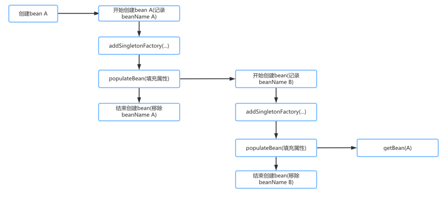

# bean的加载
通过前面标签解析，创建BeanFactory之后就可以调用getBean方法获取bean

    MyTestBean bean = (MyTestBean) beanFactory.getBean("myTestBean");

我们大概过一下getBean方法源码
```
// AbstractBeanFactory.java
@Override
public Object getBean(String name) throws BeansException {
    return doGetBean(name, null, null, false);
}

protected <T> T doGetBean(
        final String name, final Class<T> requiredType, final Object[] args, boolean typeCheckOnly)
        throws BeansException {
    // 提取beanName
    final String beanName = transformedBeanName(name);
    Object bean;

    /* 检查缓存中或实例工厂是否有对应的实例
     * 因为在创建单列bean时会存在依赖注入的情况，在创建依赖的时候为避免循环依赖，Spring创建bean的原则是不等bean创建完成就将创建bean的
     * ObjectFactory提早曝光，将ObjectFactory加入缓存中，一旦下个bean创建时要依赖上个bean则直接使用ObjectFactory。
     * 直接尝试从缓存获取或singletonFactories中的ObjectFacotry中获取
     */ 
    Object sharedInstance = getSingleton(beanName);
    if (sharedInstance != null && args == null) {
        if (logger.isDebugEnabled()) {
            if (isSingletonCurrentlyInCreation(beanName)) {
                logger.debug("Returning eagerly cached instance of singleton bean '" + beanName +
                        "' that is not fully initialized yet - a consequence of a circular reference");
            }
            else {
                logger.debug("Returning cached instance of singleton bean '" + beanName + "'");
            }
        }
        // 返回对象的实例，有时候存在诸如BeanFactory的情况并不是直接返回实例本身而是返回指定方法返回的实例
        bean = getObjectForBeanInstance(sharedInstance, name, beanName, null);
    }

    else {
        // 只有在单例模式下才会尝试解决循环依赖，原型模式情况下，如果存在A中有B的属性，B中有A的属性，那么当依赖注入时，就会产生当A创建
        // 完的时候因为对于B的创建再次返回创建A，造成循环依赖
        if (isPrototypeCurrentlyInCreation(beanName)) {
            throw new BeanCurrentlyInCreationException(beanName);
        }

        // Check if bean definition exists in this factory.
        BeanFactory parentBeanFactory = getParentBeanFactory();
        // 如果beanDefinitionMap中也就是所有已经加载的类中不包括beanName则尝试从parentBeanFactory中检查
        if (parentBeanFactory != null && !containsBeanDefinition(beanName)) {
            // Not found -> check parent.
            String nameToLookup = originalBeanName(name);
            // 递归BeanFactory中寻找
            if (args != null) {
                // Delegation to parent with explicit args.
                return (T) parentBeanFactory.getBean(nameToLookup, args);
            }
            else {
                // No args -> delegate to standard getBean method.
                return parentBeanFactory.getBean(nameToLookup, requiredType);
            }
        }
        // 如果不是仅仅做类型检查则是创建Bean
        if (!typeCheckOnly) {
            markBeanAsCreated(beanName);
        }

        try {
            // 将存储XML配置文件的GernericBeanDefinition转换成RootBeanDefinition，如果指定BeanName是子Bean会同时合并父类的相关属性
            final RootBeanDefinition mbd = getMergedLocalBeanDefinition(beanName);
            checkMergedBeanDefinition(mbd, beanName, args);

            // Guarantee initialization of beans that the current bean depends on.
            String[] dependsOn = mbd.getDependsOn();
            // 如果有依赖则需要递归实例化依赖的bean
            if (dependsOn != null) {
                for (String dependsOnBean : dependsOn) {
                    if (isDependent(beanName, dependsOnBean)) {
                        throw new BeanCreationException("Circular depends-on relationship between '" +
                                beanName + "' and '" + dependsOnBean + "'");
                    }
                    // 缓存依赖调用
                    registerDependentBean(dependsOnBean, beanName);
                    getBean(dependsOnBean);
                }
            }

            // Create bean instance.
            // 实例化依赖的bean后便可以实例化自身
            if (mbd.isSingleton()) {
                sharedInstance = getSingleton(beanName, new ObjectFactory<Object>() {
                    @Override
                    public Object getObject() throws BeansException {
                        try {
                            return createBean(beanName, mbd, args);
                        }
                        catch (BeansException ex) {
                            // Explicitly remove instance from singleton cache: It might have been put there
                            // eagerly by the creation process, to allow for circular reference resolution.
                            // Also remove any beans that received a temporary reference to the bean.
                            destroySingleton(beanName);
                            throw ex;
                        }
                    }
                });
                bean = getObjectForBeanInstance(sharedInstance, name, beanName, mbd);
            }

            else if (mbd.isPrototype()) {
                // It's a prototype -> create a new instance.
                // proportype模式的创建
                Object prototypeInstance = null;
                try {
                    beforePrototypeCreation(beanName);
                    prototypeInstance = createBean(beanName, mbd, args);
                }
                finally {
                    afterPrototypeCreation(beanName);
                }
                bean = getObjectForBeanInstance(prototypeInstance, name, beanName, mbd);
            }

            else {
                // 指定的scope上实例化bean
                String scopeName = mbd.getScope();
                final Scope scope = this.scopes.get(scopeName);
                if (scope == null) {
                    throw new IllegalStateException("No Scope registered for scope '" + scopeName + "'");
                }
                try {
                    Object scopedInstance = scope.get(beanName, new ObjectFactory<Object>() {
                        @Override
                        public Object getObject() throws BeansException {
                            beforePrototypeCreation(beanName);
                            try {
                                return createBean(beanName, mbd, args);
                            }
                            finally {
                                afterPrototypeCreation(beanName);
                            }
                        }
                    });
                    bean = getObjectForBeanInstance(scopedInstance, name, beanName, mbd);
                }
                catch (IllegalStateException ex) {
                    throw new BeanCreationException(beanName,
                            "Scope '" + scopeName + "' is not active for the current thread; " +
                            "consider defining a scoped proxy for this bean if you intend to refer to it from a singleton",
                            ex);
                }
            }
        }
        catch (BeansException ex) {
            cleanupAfterBeanCreationFailure(beanName);
            throw ex;
        }
    }

    // Check if required type matches the type of the actual bean instance.
    // 检查需要的类型是否符合bean的实际类型
    if (requiredType != null && bean != null && !requiredType.isAssignableFrom(bean.getClass())) {
        try {
            return getTypeConverter().convertIfNecessary(bean, requiredType);
        }
        catch (TypeMismatchException ex) {
            if (logger.isDebugEnabled()) {
                logger.debug("Failed to convert bean '" + name + "' to required type [" +
                        ClassUtils.getQualifiedName(requiredType) + "]", ex);
            }
            throw new BeanNotOfRequiredTypeException(name, requiredType, bean.getClass());
        }
    }
    return (T) bean;
}

```

通过上述描述可以初步了解Spring加载Bean的过程，其中涉及的流程大致如下

- 转换beanName 
  
    上述方法传入的name可能并不是beanName。传入的参数可能是别名，也可能是FactoryBean，所以需要进行一系列的解析
    
    - 去除FactoryBean的修饰符，即如果name="&aa",那么首先会去除&，name="aa"
    
    - 取指定alias所表示的最终beanName，例如别名A指向名称为B的bean则返回B；若别名A指向别名B，别名B又指向名称C的Bean，则返回C
    
- 尝试从缓存中加载单例
  
    单例在Spring同一容器中只会被创建一次，之后获取bean，直接从缓存中获取。这里首先从缓存加载，如果加载不成功则尝试从singletonFactory
中加载。因为创建单例bean的时候会存在依赖注入的情况，在创建依赖时为了避免循环依赖，在Spring中创建bean的原则是不等bean创建完成就将创建
创建bean的ObjectFactory加入到缓存，一旦下一个bean创建时需要依赖上一个bean则直接使用ObjectFactory
  
- bean的实例化

    如果从缓存中得到了bean的原生状态，则需要对bean进行实例化。缓存中记录的只是bean的原始状态，并不一定是我们最终想要的bean。例如需要对
工厂bean进行处理，这里得到的其实是工厂bean的初始状态，但我们真正需要的是工厂bean中定义的factory-method方法返回的bean，而getObjectForBeanInstance
就是完成这个工作
  
- 原型模式的依赖检查

    只有单例情况下才会尝试解决循环依赖，如果存在A中有B的属性，B中有A的属性，当依赖注入时，会产生当A还未创建完成的时候因为对B的创建再次创建
A，造成循环依赖
  
- 检测parentBeanFactory

    缓存没有数据则到父类工厂上去加载。前提是必须要有父类工厂，并且当前加载的XML配置文件中不包含beanName对应的配置

- 将存储XML配置文件的GernericBeanDefinition转换为RootBeanDefinition

    从XML配置文件中读取到的Bean信息是存储在GenericBeanDefinition中的，但是所有Bean的后续处理都是针对RootBeanDefinition，所以这里需要
进行一个转换，转换的同时如果父类bean不为空，则会一并合并父的属性
  
- 寻找依赖

    因为bean的初始化过程中可能会用到某些动态配置的属性，并且配置成依赖于其他bean，这时就需要先加载依赖的bean，因此在Spring的加载顺序中，
在初始化某个bean的时候首先会初始化其依赖的bean
  
- 针对不同的scope进行bean的创建

    Spring中存在着不同的scope，Spring会根据不同的配置进行不同的初始化策略

- 类型转换

    程序到这里返回bean后已经基本结束，通常对该方法的调用参数requiredType是为空，但可能存在这样的情况，返回的bean是个String，requiredType
却是Integer类型，那本步骤就会起作用，其功能是将返回的bean转换为requiredType所指定的类型。当然，String转换为Integer是最简单的转换，在
Spring中提供了各种各样的转换器，用户也可以自己扩展转换器来满足需求
  
经过上面步骤bean的加载就结束来，此时就可以返回我们需要的bean了。在进行深入研究各个步骤提供的功能前，我们需要先了解FactoryBean的用法

## FactoryBean的使用
通常情况下Spring通过反射机制利用bean的class属性指定实现类来实例化bean。在某些情况下，实例化bean过程复杂，按照配置文件的方式，需要在<bean>
中提供大量的配置信息，但如果使用编码的方式可能会变得更简单。为实现通过编码方式实例化bean Spring提供了org.Springframework.bean.factory.FactoryBean
工厂类接口，通过实现该接口可以定制实例化bean

FactoryBean接口对于Spring框架来说占有重要地位，Spring自身提供了大量的FactoryBean的实现。它们隐藏了实例化复杂bean的细节。从Spring 3.0
开始，FactoryBean开始支持泛型，接口声明改为FactoryBean<T>形式
```
public interface FactoryBean<T> {

	T getObject() throws Exception;

	Class<?> getObjectType();

	boolean isSingleton();
}
```

在该接口中定义了以下3个方法

- T getObject()：返回由FactoryBean创建的bean实例，如果isSingleton()返回true,则该实例会放到Spring容器中单例缓存池中

- boolean isSingleton()：返回由FactoryBean创建的bean实例的作用域是singleton还是prototype

- Class<T> getObjectType()：返回FactoryBean创建的bean类型

当配置文件中<bean>的class属性配置的实现类是FactoryBean时，通过getBean()方法返回的不是FactoryBean本身，而是FactoryBean#getObject()
方法所返回的对象。例：通过配置文件方式配置User的<bean>时，其每个属性分别对应一个<property>元素标签
```
public class User {
    private String userName;
    private String email;

    public void showMe(){
        System.out.println("I am user");
    }

    public String getUserName() {
        return userName;
    }

    public void setUserName(String userName) {
        this.userName = userName;
    }

    public String getEmail() {
        return email;
    }

    public void setEmail(String email) {
        this.email = email;
    }
}
```

如果使用FactoryBean的方式，可以灵活的定制bean
```
public class UserBeanFactory implements FactoryBean {
    @Override
    public Object getObject() throws Exception {
        User user = new User();
        user.setUserName("aa");
        user.setEmail("bb");
        return user;
    }

    @Override
    public Class<?> getObjectType() {
        return User.class;
    }

    @Override
    public boolean isSingleton() {
        return false;
    }
}
```

通过如下方式指定使用自定义FactoryBean实现bean初始化
```
<bean id="user" class="org.aim.spring.factory.UserBeanFactory"></bean>
```

当调用getBean("user")时，Spring通过反射机制发现UserBeanFactory实现了FactoryBean接口，Spring 容器会调用接口方法UserBeanFactory#getObject()
方法返回。如果希望获取CarFactoryBean实例，则需要使用getBean(beanName)方法时在beanName前添加"&"前缀，例如getBean("&user")

## 缓存中获取单列bean
单例在Spring的同一个容器内只会被创建一次，后续获取bean尝试直接从单例缓存中获取，首先尝试从缓存中加载，然后再尝试从singletonFactories中
加载。因为创建单例bean的时候会存在依赖注入的情况，而在创建依赖的时候为避免循环依赖，Spring创建bean的原则是不等bean创建完成就将创建bean的
ObjectFactory提早曝光加入到缓存中，一旦下一个bean创建时需要依赖上一个bean，则直接使用ObjectFactory
```
public Object getSingleton(String beanName) {
      // 参数true设置标识允许早起依赖
      return getSingleton(beanName, true);
  }
  
protected Object getSingleton(String beanName, boolean allowEarlyReference) {
    // 检查缓存中是否存在实例
    Object singletonObject = this.singletonObjects.get(beanName);
    if (singletonObject == null && isSingletonCurrentlyInCreation(beanName)) {
        // 如果为空，则锁定全局变量并进行处理
        synchronized (this.singletonObjects) {
            // 如果此bean正在加载则不处理
            singletonObject = this.earlySingletonObjects.get(beanName);
            if (singletonObject == null && allowEarlyReference) {
                // 当某些方法需要提前初始化的时候会调用addSingletonFactory方法将对应的objectFactory初始化策略存储在singletonFactories
                ObjectFactory<?> singletonFactory = this.singletonFactories.get(beanName);
                if (singletonFactory != null) {
                    // 调用预先设定的getObject方法
                    singletonObject = singletonFactory.getObject();
                    // 记录在缓存中，earlySingletonObjects和singletonFactories互斥
                    this.earlySingletonObjects.put(beanName, singletonObject);
                    this.singletonFactories.remove(beanName);
                }
            }
        }
    }
    return (singletonObject != NULL_OBJECT ? singletonObject : null);
}
```
这个方法首先尝试从singletonObjects里面获取实例，如果获取不到再从earlySingletonObjects中获取，如果还获取不到，再尝试从singletonFactories
中获取beanName对应ObjectFactory，然后调用这个ObjectFactory的getObject方法创建bean,并放到earlySingletonObjects里面，并且从singletonFacotories
里面remove掉这个ObjectFactory，而对于后续的所有内存操作都只为循环依赖检查时使用，也就是在allowEarlyReference为true的情况下才会使用。
上面解析可以看到从各种不同作用的map中获取缓存值，这些缓存map作用如下

- singletonObjects：用于保存BeanName和创建bean实例之间的关系，bean name -> bean instance

- singletonFactories：用于保存BeanName和创建Bean的工厂之间的关系，bean name -> ObjectFacotry

- earlySingletonObjects：保存BeanName和创建Bean实例之间的关系，与singletonObjects的不同之处在于，当一个单例bean放入这里，当bean还在创建
过程中，就可以通过getBean方法获取到，目的是用来检测循环依赖
  
- registeredSingletons：用来保存当前所有已注册的bean

## 从bean的实例中获取对象
在getBean方法中，getObjectForBeanInstance是个高频使用方法，无论是从缓存中获取bean还是根据不同的scope策略加载bean。得到bean实例后要做的
第一步就是调用这个方法检测一下正确性，其本质就是检测当前bean是否是FactoryBean类型的bean，如果是，需要调用该bean对应的FactoryBean实例中
的getObject()作为返回值

无论从缓存中获取的bean还是通过不同scope策略加载的bean都只是最原始的bean状态，并不一定是我们最终想要的bean。假设我们需要对工厂bean进行处理，
这里得到的其实是工厂bean的初始状态，我们真正需要的是工厂bean中定义的factory-method方法中返回的bean，getObjectForBeanInstance就是做此
工作的
```
protected Object getObjectForBeanInstance(
        Object beanInstance, String name, String beanName, RootBeanDefinition mbd) {

    // 如果name为以&作前缀，且beanInstance又不是FactoryBean类型则验证不通过
    if (BeanFactoryUtils.isFactoryDereference(name) && !(beanInstance instanceof FactoryBean)) {
        throw new BeanIsNotAFactoryException(transformedBeanName(name), beanInstance.getClass());
    }

    // 如果bean实例不是工厂bean，或者name是以&开头，则直接返回bean实例。其实际意义是如果用户想获取工厂bean
    // 而不是工厂bean，getObject方法返回的实例请在调用getBean方法传入name时添加&。对于非工厂bean则直接返回。
    // 对于工厂bean，并想通过工厂getObject方法获取实例bean，则需要继续执行后面操作
    if (!(beanInstance instanceof FactoryBean) || BeanFactoryUtils.isFactoryDereference(name)) {
        return beanInstance;
    }

    // 加载FactoryBean
    Object object = null;
    if (mbd == null) {
        // 尝试从缓存中加载bean
        object = getCachedObjectForFactoryBean(beanName);
    }
    if (object == null) {
        // Return bean instance from factory.
        FactoryBean<?> factory = (FactoryBean<?>) beanInstance;
        // containsBeanDefinition检测beanDefinitionMap中也就是所有已经加载的类中检测是否包含beanName
        if (mbd == null && containsBeanDefinition(beanName)) {
            // 将存储XML配置文件的GernericBeanDefinition转换为RootBeanDefinitio，如果指定BeanName是子Bean同时会合并父类的相关属性
            mbd = getMergedLocalBeanDefinition(beanName);
        }
        // 是否是用户定义的而不是应用程序本身定义的
        boolean synthetic = (mbd != null && mbd.isSynthetic());
        object = getObjectFromFactoryBean(factory, beanName, !synthetic);
    }
    return object;
}
```
此方法中逻辑都是一些功能性判断，真正核心的逻辑在getObjectFromFactoryBean方法中。在getObjectForBeanInstance方法中主要完成如下工作

-  对FactoryBean正确性验证

- 对非FactoryBean不做任何处理

- 对bean进行转换

- 将从Factory中解析bean的工作委托给getObjectFromFactoryBean

getObjectFactoryBean方法实现如下
```
protected Object getObjectFromFactoryBean(FactoryBean<?> factory, String beanName, boolean shouldPostProcess) {
    if (factory.isSingleton() && containsSingleton(beanName)) {
        synchronized (getSingletonMutex()) {
            Object object = this.factoryBeanObjectCache.get(beanName);
            if (object == null) {
                object = doGetObjectFromFactoryBean(factory, beanName, shouldPostProcess);
                this.factoryBeanObjectCache.put(beanName, (object != null ? object : NULL_OBJECT));
            }
            return (object != NULL_OBJECT ? object : null);
        }
    }
    else {
        return doGetObjectFromFactoryBean(factory, beanName, shouldPostProcess);
    }
}
```
这个方法中判断如果是单例并且缓存中包含这个bean，则从缓存中获取，如果获取不到则调用doGetObjectFromFactoryBean获取bean，并放入缓存中，如果
不是单例或缓存中没有该bean，则直接通过doGetObjectFromFactoryBean获取bean。doGetObjectFromFactoryBean代码实现如下
```
private Object doGetObjectFromFactoryBean(
        final FactoryBean<?> factory, final String beanName, final boolean shouldPostProcess)
        throws BeanCreationException {

    Object object;
    try {
        // 需要权限验证
        if (System.getSecurityManager() != null) {
            AccessControlContext acc = getAccessControlContext();
            try {
                object = AccessController.doPrivileged(new PrivilegedExceptionAction<Object>() {
                    @Override
                    public Object run() throws Exception {
                            return factory.getObject();
                        }
                    }, acc);
            }
            catch (PrivilegedActionException pae) {
                throw pae.getException();
            }
        }
        else {
            // 直接调用getObject方法
            object = factory.getObject();
        }
    }
    catch (FactoryBeanNotInitializedException ex) {
        throw new BeanCurrentlyInCreationException(beanName, ex.toString());
    }
    catch (Throwable ex) {
        throw new BeanCreationException(beanName, "FactoryBean threw exception on object creation", ex);
    }


    // Do not accept a null value for a FactoryBean that's not fully
    // initialized yet: Many FactoryBeans just return null then.
    if (object == null && isSingletonCurrentlyInCreation(beanName)) {
        throw new BeanCurrentlyInCreationException(
                beanName, "FactoryBean which is currently in creation returned null from getObject");
    }

    if (object != null && shouldPostProcess) {
        try {
            // 调用objectFactory的后处理器
            object = postProcessObjectFromFactoryBean(object, beanName);
        }
        catch (Throwable ex) {
            throw new BeanCreationException(beanName, "Post-processing of the FactoryBean's object failed", ex);
        }
    }

    return object;
}
```
如果bean声明为FactoryBean类型，则当提取bean时提取的并不是FactoryBean，而是FactoryBean中对应的getObject方法返回的bean，再通过factory.getObject()得到
我们需要的结果后并没有直接返回，而是调用AbstractAutowireCapableBeanFactory类的postProcessObjectFactoryBean方法调用后置处理器
```
public Object applyBeanPostProcessorsAfterInitialization(Object existingBean, String beanName)
        throws BeansException {

    Object result = existingBean;
    for (BeanPostProcessor beanProcessor : getBeanPostProcessors()) {
        result = beanProcessor.postProcessAfterInitialization(result, beanName);
        if (result == null) {
            return result;
        }
    }
    return result;
}
```
用户可以自己实现BeanPostProcessor接口方法，当bean初始化后会调用用户实现的postProcessAfterInitialization方法

## 获取单列
如果缓存中不存在已经加载的单例bean就需要从头开始bean的加载过程，Spring中使用getSingleton的重载方法实现bean的加载过程
```
public Object getSingleton(String beanName, ObjectFactory<?> singletonFactory) {
    Assert.notNull(beanName, "'beanName' must not be null");
    // 全局变量需要同步
    synchronized (this.singletonObjects) {
        // 检查对应的bean是否已经被加载过，如果已被加载过则直接返回
        Object singletonObject = this.singletonObjects.get(beanName);
        if (singletonObject == null) {
            if (this.singletonsCurrentlyInDestruction) {
                throw new BeanCreationNotAllowedException(beanName,
                        "Singleton bean creation not allowed while the singletons of this factory are in destruction " +
                        "(Do not request a bean from a BeanFactory in a destroy method implementation!)");
            }
            if (logger.isDebugEnabled()) {
                logger.debug("Creating shared instance of singleton bean '" + beanName + "'");
            }
            beforeSingletonCreation(beanName);
            boolean recordSuppressedExceptions = (this.suppressedExceptions == null);
            if (recordSuppressedExceptions) {
                this.suppressedExceptions = new LinkedHashSet<Exception>();
            }
            try {
                // 初始化bean
                singletonObject = singletonFactory.getObject();
            }
            catch (BeanCreationException ex) {
                if (recordSuppressedExceptions) {
                    for (Exception suppressedException : this.suppressedExceptions) {
                        ex.addRelatedCause(suppressedException);
                    }
                }
                throw ex;
            }
            finally {
                if (recordSuppressedExceptions) {
                    this.suppressedExceptions = null;
                }
                afterSingletonCreation(beanName);
            }
            // 加入缓存
            addSingleton(beanName, singletonObject);
        }
        return (singletonObject != NULL_OBJECT ? singletonObject : null);
    }
}
```
在单例创建的前后通过回调方法做一些准备及处理操作,真正获取单例bean的方法是在singletonFactory的getObject方法获取。在上述方法中主要做了如下
处理

- 检查缓存是否已经加载过

- 若没有加载，则记录beanName的正在加载状态

- 加载单例前记录加载状态

  看似beforeSingletonCreation方法是空实现，没有任何逻辑，但其实这个函数实现了记录加载状态的操作。即通过this.singletonsCurrentlyInCreation.add(beanName)
将当前正要创建的bean记录在缓存中，这样便可以对循环依赖进行检测
  ```
  protected void beforeSingletonCreation(String beanName) {
		if (!this.inCreationCheckExclusions.contains(beanName) &&
				!this.singletonsCurrentlyInCreation.add(beanName)) {
			throw new BeanCurrentlyInCreationException(beanName);
		}
	}
  ```
  
- 通过调用参数传入的ObjectFactory的getObject方法实例化bean

- 加载单例后的处理方法调用

  当bean加载结束后需要移除缓存中对该bean的正在加载状态的记录
  ```java
  protected void afterSingletonCreation(String beanName) {
		if (!this.inCreationCheckExclusions.contains(beanName) &&
				!this.singletonsCurrentlyInCreation.remove(beanName)) {
			throw new IllegalStateException("Singleton '" + beanName + "' isn't currently in creation");
		}
	}
  ```
  
- 将结果记录至缓存并删除加载bean过程中所记录的各种辅助状态
```
protected void addSingleton(String beanName, Object singletonObject) {
    synchronized (this.singletonObjects) {
        this.singletonObjects.put(beanName, (singletonObject != null ? singletonObject : NULL_OBJECT));
        this.singletonFactories.remove(beanName);
        this.earlySingletonObjects.remove(beanName);
        this.registeredSingletons.add(beanName);
    }
}
```

- 返回处理结果
  
  bean的加载逻辑其实是在传入的ObjectFactory类型的参数singletonFactory中定义。ObjectFactory的核心部分只是调用了createBean的方法
  ```
  sharedInstance = getSingleton(beanName, new ObjectFactory<Object>() {
        @Override
        public Object getObject() throws BeansException {
            try {
                return createBean(beanName, mbd, args);
            }
            catch (BeansException ex) {
                // Explicitly remove instance from singleton cache: It might have been put there
                // eagerly by the creation process, to allow for circular reference resolution.
                // Also remove any beans that received a temporary reference to the bean.
                destroySingleton(beanName);
                throw ex;
            }
        }
    });
  ```
  
## 准备创建Bean
进入createBean方法就正式开始进入创建bean的逻辑
```
protected Object createBean(final String beanName, final RootBeanDefinition mbd, final Object[] args)
        throws BeanCreationException {

    if (logger.isDebugEnabled()) {
        logger.debug("Creating instance of bean '" + beanName + "'");
    }
    // 锁定class,根据设置的class属性或者根据className来解析Class
    resolveBeanClass(mbd, beanName);

    // 验证及准备覆盖的方法
    try {
        mbd.prepareMethodOverrides();
    }
    catch (BeanDefinitionValidationException ex) {
        throw new BeanDefinitionStoreException(mbd.getResourceDescription(),
                beanName, "Validation of method overrides failed", ex);
    }

    try {
        // 提供通过BeanPostProcessors返回代理替代真正实例机会
        Object bean = resolveBeforeInstantiation(beanName, mbd);
        if (bean != null) {
            return bean;
        }
    }
    catch (Throwable ex) {
        throw new BeanCreationException(mbd.getResourceDescription(), beanName,
                "BeanPostProcessor before instantiation of bean failed", ex);
    }

    Object beanInstance = doCreateBean(beanName, mbd, args);
    if (logger.isDebugEnabled()) {
        logger.debug("Finished creating instance of bean '" + beanName + "'");
    }
    return beanInstance;
}
```

createBean方法完成的具体步骤和功能如下

- 根据设置的class属性或者根据className来解析Class

- 对override属性进行标记及验证

  在Spring中没有override-method这样的配置，但在Spring配置中存在lookup-method和replace-method，这两个配置的加载是将配置统一放在BeanDefiniton
中的methodOverrides属性中，这个函数的操作就是针对这两个配置
  
- 应用初始化前的后处理器，解析指定bean是否存在初始化前的短路操作

- 创建bean

### 处理override属性
AbstractBeanDefiniton中的prepareMethodOverrides方法如下
```
public void prepareMethodOverrides() throws BeanDefinitionValidationException {
    // Check that lookup methods exists.
    MethodOverrides methodOverrides = getMethodOverrides();
    if (!methodOverrides.isEmpty()) {
        for (MethodOverride mo : methodOverrides.getOverrides()) {
            prepareMethodOverride(mo);
        }
    }
}

protected void prepareMethodOverride(MethodOverride mo) throws BeanDefinitionValidationException {
    // 获取对应类中对应方法名的个数
    int count = ClassUtils.getMethodCountForName(getBeanClass(), mo.getMethodName());
    if (count == 0) {
        throw new BeanDefinitionValidationException(
                "Invalid method override: no method with name '" + mo.getMethodName() +
                "' on class [" + getBeanClassName() + "]");
    }
    else if (count == 1) {
        // 标记MethodOverride暂未被覆盖，避免参数类型检查的开箱
        mo.setOverloaded(false);
    }
}
```

Spring中lookup-method和replace-method两个配置会统一放在BeanDefinition的methodOverrides属性中，在bean实例化时如果检测到存在methodOverrides属性，
会动态为当前bean生成代理并使用对应的拦截器为bean做增强处理

如果一个类中存在若干个重载方法，在函数调用及增强的时候还需要根据参数类型进行匹配，来最终确认当前调用的到底是哪个函数。但是，Spring将一部分
匹配工作在这里完成，如当前类中的方法只有一个，那么就设置重载该方法没有被重载，后续调用时可以直接使用找到的方法，而无需进行方法的参数匹配验证，
并且还可以提前对方法存在性进行验证

### 实例化的前置处理
在真正调用doCreate方法创建bean的实例前使用resolveBeforeInstantiation(beanName, mbd)对BeanDefinition中的属性做前置处理。在真正逻辑
实现前后留有处理函数也是可扩展的一种体现。在函数中还提供了一个短路判断
```
if(bean != null){
  return bean;
}
```

当经过前置处理后返回的结果如果不为空，那么会直接略过后续的Bean的创建而直接返回结果。我们熟悉的AOP功能就是基于这里的判断
```
protected Object resolveBeforeInstantiation(String beanName, RootBeanDefinition mbd) {
    Object bean = null;
    // 如果尚未被解析
    if (!Boolean.FALSE.equals(mbd.beforeInstantiationResolved)) {
        // Make sure bean class is actually resolved at this point.
        if (mbd.hasBeanClass() && !mbd.isSynthetic() && hasInstantiationAwareBeanPostProcessors()) {
            bean = applyBeanPostProcessorsBeforeInstantiation(mbd.getBeanClass(), beanName);
            if (bean != null) {
                bean = applyBeanPostProcessorsAfterInitialization(bean, beanName);
            }
        }
        mbd.beforeInstantiationResolved = (bean != null);
    }
    return bean;
}
```

此方法中两个方法applyBeanPostProcessorsBeforeInstantiation以及applyBeanPostProcessorsAfterInitialization，完成对所有
InstantiationAwareBeanPostProcessor类型的后处理器方法postProcessBeforeIntantiation的调用和BeanPostProcessor
的postProcessAfterInitialization方法的调用

#### 实例化前的后处理器应用
bean实例化前调用，即将AbstractBeanDefinition转换为BeanWrapper前的处理。给使用者修改Bean生成的机会
```
protected Object applyBeanPostProcessorsBeforeInstantiation(Class<?> beanClass, String beanName)
        throws BeansException {

    for (BeanPostProcessor bp : getBeanPostProcessors()) {
        if (bp instanceof InstantiationAwareBeanPostProcessor) {
            InstantiationAwareBeanPostProcessor ibp = (InstantiationAwareBeanPostProcessor) bp;
            Object result = ibp.postProcessBeforeInstantiation(beanClass, beanName);
            if (result != null) {
                return result;
            }
        }
    }
    return null;
}
```

#### 实例化后的后处理器
Spring中的规则是在Bean初始化后尽可能保证将注册的后处理器的postProcessAfterInitializaiton方法应用到该Bean，如果返回的bean不为空，则
不会再经历普通bean的常见过程，而是调用后处理器后返回，使用者可以在后处理器中对bean进行修改
```
@Override
public Object applyBeanPostProcessorsAfterInitialization(Object existingBean, String beanName)
        throws BeansException {

    Object result = existingBean;
    for (BeanPostProcessor beanProcessor : getBeanPostProcessors()) {
        result = beanProcessor.postProcessAfterInitialization(result, beanName);
        if (result == null) {
            return result;
        }
    }
    return result;
}
```

## 循环依赖

### 循环依赖的概念
循环依赖是指两个或多个bean相互之间持有对方，比如CircleA引用CircleB,CircleB引用CircleC,CircleC引用CircleA，形成一个引用环

### Spring如何解决循环依赖
Spring容器循环依赖包括构造器循环依赖和setter循环依赖，以下定义了循环依赖
```
public class TestA {
    private TestB testB;
    
    public TestA(TestB testB){
        this.testB = testB;
    }

    public TestB getTestB() {
        return testB;
    }

    public void setTestB(TestB testB) {
        this.testB = testB;
    }
}

public class TestB {
    private TestC testC;

    public TestB(TestC testC){
        this.testC = testC;
    }

    public TestC getTestC() {
        return testC;
    }

    public void setTestC(TestC testC) {
        this.testC = testC;
    }
}

public class TestC {
    private TestA testA;

    public TestC(TestA testA){
        this.testA = testA;
    }

    public TestA getTestA() {
        return testA;
    }

    public void setTestA(TestA testA) {
        this.testA = testA;
    }
}
```

#### 构造器循环依赖
表示通过构造器注入构成的循环依赖，此依赖是无法解决，只能抛出BeanCurrentlyInCreationException异常表示循环依赖。如上TestA构造器创建时，
需要去创建TestB，而通过TestB构造器创建TestB时，又需要调用TestC的构造器创建TestC，但TestC构造器又会调用TestA构造器，形成环，无法完成创建。

Spring容器将每一个正在创建的bean标识符放在正在创建bean的缓存中，bean标识符在创建过程中将一直保持在这个缓存中，如果在创建bean过程中发现自己
已经在这个正在创建的bean的缓存中，将抛出BeanCurrentlyInCreationExcption异常表示循环依赖；对于创建完毕的bean将从正在创建bean缓存中清除掉

##### 创建配置文件
```
<bean id="testA" class="org.aim.spring.circle.TestA">
    <constructor-arg index="0" ref="testB"/>
</bean>

<bean id="testB" class="org.aim.spring.circle.TestB">
    <constructor-arg index="0" ref="testC"/>
</bean>

<bean id="testC" class="org.aim.spring.circle.TestC">
    <constructor-arg index="0" ref="testA"/>
</bean>
```

##### 创建测试
```
@Test
public void contextLoads() {
    BeanFactory beanFactory = new XmlBeanFactory(new ClassPathResource("ApplicationContext.xml"));
    MyTestBean bean = (MyTestBean) beanFactory.getBean("testA");
}
```

- Spring容器创建"testA"，首先去"当前正在创建bean缓存"查找是否当前bean正在创建，未发现，则继续准备其需要的构造器参数"testB"，并将"testA"
标识符放到"当前正在创建bean缓存"
  
- Spring容器创建"testB"，首先查看"当前正在创建bean缓存"是否能查到当前bean正在创建，没有发现，则继续准备需要的构造器参数"testC"，并将
"testB"标识符放到"当前正在创建bean缓存"
  
- Spring容器创建"testC"，首先查看"当前正在创建bean缓存"是否能查到当前bean，如果没有发现，继续准备需要的构造器参数"testA"，并将"testC"
标识符放到"当前正在创建bean缓存"
  
- 到此Spring容器去创建"testA" bean，发现该bean标识符在"当前正在创建bean缓存"中，则抛出BeanCurrentlyInCreationException

#### setter循环依赖
通过setter注入方式构成的循环依赖。对于setter注入构造的依赖是通过Spring容器提前暴露刚完成构造器注入但未完成其他步骤的bean来完成，而且只能
解决单例作用域的bean循环依赖。通过提前暴露一个单例工厂方法，从而使得其它bean能引用到该bean
```
protected Object doCreateBean(final String beanName, final RootBeanDefinition mbd, final Object[] args) {
    // Instantiate the bean.
    BeanWrapper instanceWrapper = null;
    if (mbd.isSingleton()) {
        instanceWrapper = this.factoryBeanInstanceCache.remove(beanName);
    }
    if (instanceWrapper == null) {
        instanceWrapper = createBeanInstance(beanName, mbd, args);
    }
    final Object bean = (instanceWrapper != null ? instanceWrapper.getWrappedInstance() : null);
    Class<?> beanType = (instanceWrapper != null ? instanceWrapper.getWrappedClass() : null);

    // Allow post-processors to modify the merged bean definition.
    synchronized (mbd.postProcessingLock) {
        if (!mbd.postProcessed) {
            applyMergedBeanDefinitionPostProcessors(mbd, beanType, beanName);
            mbd.postProcessed = true;
        }
    }

    // Eagerly cache singletons to be able to resolve circular references
    // even when triggered by lifecycle interfaces like BeanFactoryAware.
    boolean earlySingletonExposure = (mbd.isSingleton() && this.allowCircularReferences &&
            isSingletonCurrentlyInCreation(beanName));
    if (earlySingletonExposure) {
        if (logger.isDebugEnabled()) {
            logger.debug("Eagerly caching bean '" + beanName +
                    "' to allow for resolving potential circular references");
        }
        // 提前暴露一个单例工厂
        addSingletonFactory(beanName, new ObjectFactory<Object>() {
            @Override
            public Object getObject() throws BeansException {
                return getEarlyBeanReference(beanName, mbd, bean);
            }
        });
    }

    // Initialize the bean instance.
    Object exposedObject = bean;
    try {
        populateBean(beanName, mbd, instanceWrapper);
        if (exposedObject != null) {
            exposedObject = initializeBean(beanName, exposedObject, mbd);
        }
    }
    catch (Throwable ex) {
        if (ex instanceof BeanCreationException && beanName.equals(((BeanCreationException) ex).getBeanName())) {
            throw (BeanCreationException) ex;
        }
        else {
            throw new BeanCreationException(mbd.getResourceDescription(), beanName, "Initialization of bean failed", ex);
        }
    }

    if (earlySingletonExposure) {
        Object earlySingletonReference = getSingleton(beanName, false);
        if (earlySingletonReference != null) {
            if (exposedObject == bean) {
                exposedObject = earlySingletonReference;
            }
            else if (!this.allowRawInjectionDespiteWrapping && hasDependentBean(beanName)) {
                String[] dependentBeans = getDependentBeans(beanName);
                Set<String> actualDependentBeans = new LinkedHashSet<String>(dependentBeans.length);
                for (String dependentBean : dependentBeans) {
                    if (!removeSingletonIfCreatedForTypeCheckOnly(dependentBean)) {
                        actualDependentBeans.add(dependentBean);
                    }
                }
                if (!actualDependentBeans.isEmpty()) {
                    throw new BeanCurrentlyInCreationException(beanName,
                            "Bean with name '" + beanName + "' has been injected into other beans [" +
                            StringUtils.collectionToCommaDelimitedString(actualDependentBeans) +
                            "] in its raw version as part of a circular reference, but has eventually been " +
                            "wrapped. This means that said other beans do not use the final version of the " +
                            "bean. This is often the result of over-eager type matching - consider using " +
                            "'getBeanNamesOfType' with the 'allowEagerInit' flag turned off, for example.");
                }
            }
        }
    }

    // Register bean as disposable.
    try {
        registerDisposableBeanIfNecessary(beanName, bean, mbd);
    }
    catch (BeanDefinitionValidationException ex) {
        throw new BeanCreationException(mbd.getResourceDescription(), beanName, "Invalid destruction signature", ex);
    }

    return exposedObject;
}
```

- Spring容器创建单例"testA" bean，首先根据无参构造器创建bean，并暴露一个"ObjectFactory"用于返回一个提前暴露一个创建中的bean，并将"testA"
标识符放到"当前正在创建bean缓存"，然后进行setter注入"testB"
  
- Spring容器创建单例"testB" bean，首先根据无参构造器创建bean，并暴露一个"ObjectFactory"用于返回一个提前暴露一个创建中的bean，并将"testB"
标识符放到"当前正在创建bean缓存"，然后setter注入"circle"
  
- Spring容器创建单例"testC" bean，首先根据无参构造器创建bean，并暴露一个"ObjectFactory"用于返回一个提前暴露一个创建中的bean，并将"testC"
标识符放到"当前正在创建bean缓存"，然后进行setter注入"testA"，由于提前暴露了"ObjectFactory"工厂，从而使用它返回一个提前暴露的创建中的bean
  
- 最后依赖注入"testB"和"testA"，完成setter注入

对于其它作用域的bean，setter注入方式并不能解决循环依赖，只有单例bean才会提前暴露ObjectFactory。我们也可以通过setAllowCircularReferences(false)
方法禁用循环引用

## 创建bean
通过resolveBeforeInstantiation处理后，如果没有重写InstantitationAwareBeanPostProcessor的postProcessBeforeInstantitation方法并
改变bean，则进入常规创建bean逻辑，常规bean创建逻辑在doCreateBean中完成
```
protected Object doCreateBean(final String beanName, final RootBeanDefinition mbd, final Object[] args) {
    // Instantiate the bean.
    BeanWrapper instanceWrapper = null;
    if (mbd.isSingleton()) {
        instanceWrapper = this.factoryBeanInstanceCache.remove(beanName);
    }
    if (instanceWrapper == null) {
        // 根据指定bean使用对应的策略创建新的实例，如：工厂方法、构造函数自动注入、简单初始化
        instanceWrapper = createBeanInstance(beanName, mbd, args);
    }
    final Object bean = (instanceWrapper != null ? instanceWrapper.getWrappedInstance() : null);
    Class<?> beanType = (instanceWrapper != null ? instanceWrapper.getWrappedClass() : null);

    // Allow post-processors to modify the merged bean definition.
    synchronized (mbd.postProcessingLock) {
        if (!mbd.postProcessed) {
            // 调用MergedBeanDefinitionPostProcessor的方法
            applyMergedBeanDefinitionPostProcessors(mbd, beanType, beanName);
            mbd.postProcessed = true;
        }
    }

    // 是否需要提前曝光：单例&允许循环依赖&当前bean正在创建中，检测循环依赖
    boolean earlySingletonExposure = (mbd.isSingleton() && this.allowCircularReferences &&
            isSingletonCurrentlyInCreation(beanName));
    if (earlySingletonExposure) {
        if (logger.isDebugEnabled()) {
            logger.debug("Eagerly caching bean '" + beanName +
                    "' to allow for resolving potential circular references");
        }
        // 为避免后期循环依赖，在bean初始化完成前将创建实例的ObjectFactory加入工厂
        addSingletonFactory(beanName, new ObjectFactory<Object>() {
            @Override
            public Object getObject() throws BeansException {
                // 对bean再一次依赖引用，主要应用SmartInstantiationAwareBeanPostProcessor，AOP就是在这里将advice动态织入bean中，
                // 若没有直接返回bean，不做任何处理
                return getEarlyBeanReference(beanName, mbd, bean);
            }
        });
    }

    // Initialize the bean instance.
    Object exposedObject = bean;
    try {
        // 对bean进行填充，将各个属性值注入，其中，可能存在依赖于其他bean的属性，会递归初始依赖bean
        populateBean(beanName, mbd, instanceWrapper);
        if (exposedObject != null) {
            // 调用初始化方法，如init-method
            exposedObject = initializeBean(beanName, exposedObject, mbd);
        }
    }
    catch (Throwable ex) {
        if (ex instanceof BeanCreationException && beanName.equals(((BeanCreationException) ex).getBeanName())) {
            throw (BeanCreationException) ex;
        }
        else {
            throw new BeanCreationException(mbd.getResourceDescription(), beanName, "Initialization of bean failed", ex);
        }
    }

    if (earlySingletonExposure) {
        Object earlySingletonReference = getSingleton(beanName, false);
        // earlySingletonReference 只有检测到有循环依赖的情况下才会不为空
        if (earlySingletonReference != null) {
            // 如果exposedObject
            if (exposedObject == bean) {
                exposedObject = earlySingletonReference;
            }
            else if (!this.allowRawInjectionDespiteWrapping && hasDependentBean(beanName)) {
                String[] dependentBeans = getDependentBeans(beanName);
                Set<String> actualDependentBeans = new LinkedHashSet<String>(dependentBeans.length);
                for (String dependentBean : dependentBeans) {
                    // 检测依赖
                    if (!removeSingletonIfCreatedForTypeCheckOnly(dependentBean)) {
                        actualDependentBeans.add(dependentBean);
                    }
                }
                /*
                * 因为bean创建后其依赖的bean一定是已经创建的，actualDependentBeans不为空表示当前bean创建后其
                * 依赖的bean却没有全部创建完，也就是说存在循环依赖
                */
                if (!actualDependentBeans.isEmpty()) {
                    throw new BeanCurrentlyInCreationException(beanName,
                            "Bean with name '" + beanName + "' has been injected into other beans [" +
                            StringUtils.collectionToCommaDelimitedString(actualDependentBeans) +
                            "] in its raw version as part of a circular reference, but has eventually been " +
                            "wrapped. This means that said other beans do not use the final version of the " +
                            "bean. This is often the result of over-eager type matching - consider using " +
                            "'getBeanNamesOfType' with the 'allowEagerInit' flag turned off, for example.");
                }
            }
        }
    }

    // Register bean as disposable.
    try {
        // 根据scopse注册bean
        registerDisposableBeanIfNecessary(beanName, bean, mbd);
    }
    catch (BeanDefinitionValidationException ex) {
        throw new BeanCreationException(mbd.getResourceDescription(), beanName, "Invalid destruction signature", ex);
    }

    return exposedObject;
}
```

整个函数的概要思路如下

- 如果是单例则需要首先清除缓存

- 实例化bean，将BeanDefinition转变为BeanWrapper。转换的大致过程如下

  - 如果存在工厂方法则使用工厂方法进行初始化
  
  - 一个类有多个构造函数，每个构造函数都有不同的参数，所以需要根据参数锁定构造函数并进行初始化
  
  - 如果既不存在工厂方法也不存在带参数的构造函数，则使用默认的构造函数进行bean的实例化
  
- MergedBeanDefinitionPostProcessor应用

  - bean合并后的处理，Autowired注解正是通过此方法实现诸如类型的预解析
  
- 依赖处理

  - 在Spring中对于循环依赖，会通过放入缓存中的ObjectFactory来创建实例，解决循环依赖的问题
  
- 属性填充，将所有属性填充至bean的实例中

- 循环依赖检查

  - 在Spring中解决循环依赖只对单例有效，对prototype的bean，Spring没有好的解决办法，唯一要做的就是抛出异常。在这个步骤会检测已经加载的bean 
    是否已经出现依赖循环，并判断是否需要抛出异常
    
- 注册DisposableBean。如果配置了destroy-method，在这里需要注册便于之后销毁时调用

- 完成创建并返回

### 创建bean实例
createBeanInstance完成bean实例的创建
```
protected BeanWrapper createBeanInstance(String beanName, RootBeanDefinition mbd, Object[] args) {
    // 解析class
    Class<?> beanClass = resolveBeanClass(mbd, beanName);

    if (beanClass != null && !Modifier.isPublic(beanClass.getModifiers()) && !mbd.isNonPublicAccessAllowed()) {
        throw new BeanCreationException(mbd.getResourceDescription(), beanName,
                "Bean class isn't public, and non-public access not allowed: " + beanClass.getName());
    }
    // 如果工厂方法不为空则使用工厂方法初始化策略
    if (mbd.getFactoryMethodName() != null)  {
        return instantiateUsingFactoryMethod(beanName, mbd, args);
    }

    // Shortcut when re-creating the same bean...
    boolean resolved = false;
    boolean autowireNecessary = false;
    if (args == null) {
        synchronized (mbd.constructorArgumentLock) {
            // 一个类有多个构造函数，每个构造函数有不同的参数，所以调用前需要先根据参数锁定构造函数或对应的工厂方法
            if (mbd.resolvedConstructorOrFactoryMethod != null) {
                resolved = true;
                autowireNecessary = mbd.constructorArgumentsResolved;
            }
        }
    }
    // 如果已经解析过则使用解析好的构造函数方法不需要再次锁定
    if (resolved) {
        if (autowireNecessary) {
            // 构造函数自动注入
            return autowireConstructor(beanName, mbd, null, null);
        }
        else {
            // 使用默认构造函数构造
            return instantiateBean(beanName, mbd);
        }
    }

    // 需要根据参数解析构造函数
    Constructor<?>[] ctors = determineConstructorsFromBeanPostProcessors(beanClass, beanName);
    if (ctors != null ||
            mbd.getResolvedAutowireMode() == RootBeanDefinition.AUTOWIRE_CONSTRUCTOR ||
            mbd.hasConstructorArgumentValues() || !ObjectUtils.isEmpty(args))  {
        // 构造函数自动注入    
        return autowireConstructor(beanName, mbd, ctors, args);
    }

    // 使用默认构造函数
    return instantiateBean(beanName, mbd);
}
```
- 如果在RootBeanDefinition中存在factoryMethodName属性，或者说在配置文件中配置了factory-method，那么Spring会尝试使用instantiateUsingFacotoryMethod
  (beanName, mbd, args)方法根据RootBeanDefiniton中的配置生成bean实例
  
- 解析构造函数并进行构造函数的实例化。一个bean中对应的类中可能会有多个构造函数，每个构造函数具有不同的参数，Spring根据参数及类型判断最终
使用那个构造函数进行实例化。解析判断的过程是一个耗时的过程，Spring会缓存解析的成果，并放到RootBeanDefinition中的属性resolvedConstructorOrFactoryMethod
中。对于已经解析过直接获取解析结果并进行构造函数实例化，对于未解析过则先解析再进行实例化，并缓存解析结果

  - autowireConstructor
    
    对于实例的创建Spring分两种情况，一种是通用的实例化；另一种是带参数的实例化。带参数的实例化过程相当复杂，存在不确定性，需要在参数上做
  大量工作
    ```
      public BeanWrapper autowireConstructor(
			final String beanName, final RootBeanDefinition mbd, Constructor<?>[] chosenCtors, final Object[] explicitArgs) {

		BeanWrapperImpl bw = new BeanWrapperImpl();
		this.beanFactory.initBeanWrapper(bw);

		Constructor<?> constructorToUse = null;
		ArgumentsHolder argsHolderToUse = null;
		Object[] argsToUse = null;
        // explicitArgs通过getBean方法传入，如果getBean方法调用的时候指定方法参数那么直接使用
		if (explicitArgs != null) {
			argsToUse = explicitArgs;
		}
		else {
            // 如果getBean方法没有指定则尝试从配置文件中解析
			Object[] argsToResolve = null;
            // 尝试从缓存中获取
			synchronized (mbd.constructorArgumentLock) {
				constructorToUse = (Constructor<?>) mbd.resolvedConstructorOrFactoryMethod;
				if (constructorToUse != null && mbd.constructorArgumentsResolved) {
					// 从缓存中获取
					argsToUse = mbd.resolvedConstructorArguments;
					if (argsToUse == null) {
                        // 配置的构造函数参数
						argsToResolve = mbd.preparedConstructorArguments;
					}
				}
			}
            // 如果缓存中存在
			if (argsToResolve != null) {
                // 解析参数类型，如果给定的构造函数A(int, int)则通过此方法后就会把配置中的("1", "1")转换为(1, 1)。缓存中的值可能是原始
                // 值也可能是最终值
				argsToUse = resolvePreparedArguments(beanName, mbd, bw, constructorToUse, argsToResolve);
			}
		}
        // 没有被缓存
		if (constructorToUse == null) {
			// Need to resolve the constructor.
			boolean autowiring = (chosenCtors != null ||
					mbd.getResolvedAutowireMode() == RootBeanDefinition.AUTOWIRE_CONSTRUCTOR);
			ConstructorArgumentValues resolvedValues = null;

			int minNrOfArgs;
			if (explicitArgs != null) {
				minNrOfArgs = explicitArgs.length;
			}
			else {
                // 提取配置文件中的构造函数参数
				ConstructorArgumentValues cargs = mbd.getConstructorArgumentValues();
                // 记录解析后的构造函数参数的值
				resolvedValues = new ConstructorArgumentValues();
                // 能解析到的参数个数
				minNrOfArgs = resolveConstructorArguments(beanName, mbd, bw, cargs, resolvedValues);
			}

			// Take specified constructors, if any.
			Constructor<?>[] candidates = chosenCtors;
			if (candidates == null) {
				Class<?> beanClass = mbd.getBeanClass();
				try {
					candidates = (mbd.isNonPublicAccessAllowed() ?
							beanClass.getDeclaredConstructors() : beanClass.getConstructors());
				}
				catch (Throwable ex) {
					throw new BeanCreationException(mbd.getResourceDescription(), beanName,
							"Resolution of declared constructors on bean Class [" + beanClass.getName() +
									"] from ClassLoader [" + beanClass.getClassLoader() + "] failed", ex);
				}
			}
            // 排序给定的构造函数，public构造函数优先于非pulbic构造函数，参数多的构造函数优先参数少的构造函数
			AutowireUtils.sortConstructors(candidates);
			int minTypeDiffWeight = Integer.MAX_VALUE;
			Set<Constructor<?>> ambiguousConstructors = null;
			List<Exception> causes = null;

			for (int i = 0; i < candidates.length; i++) {
				Constructor<?> candidate = candidates[i];
				Class<?>[] paramTypes = candidate.getParameterTypes();

				if (constructorToUse != null && argsToUse.length > paramTypes.length) {
					// 如果已经找到选用的构造函数或需要的参数个数小于当前的构造函数参数个数则终止，因为已经按照参数个数降序排列
					break;
				}
				if (paramTypes.length < minNrOfArgs) {
                    // 参数个数不相等
					continue;
				}

				ArgumentsHolder argsHolder;
				if (resolvedValues != null) {
                    // 有参数则根据值构造对应参数类型的参数
					try {
						String[] paramNames = null;
						if (constructorPropertiesAnnotationAvailable) {
                            // 注释上获取参数名称
							paramNames = ConstructorPropertiesChecker.evaluateAnnotation(candidate, paramTypes.length);
						}
						if (paramNames == null) {
                            // 获取参数名称探索器
							ParameterNameDiscoverer pnd = this.beanFactory.getParameterNameDiscoverer();
							if (pnd != null) {
                                // 获取指定构造函数的参数名称
								paramNames = pnd.getParameterNames(candidate);
							}
						}
                        // 根据名称和数据类型创建参数持有者
						argsHolder = createArgumentArray(
								beanName, mbd, resolvedValues, bw, paramTypes, paramNames, candidate, autowiring);
					}
					catch (UnsatisfiedDependencyException ex) {
						if (this.beanFactory.logger.isTraceEnabled()) {
							this.beanFactory.logger.trace(
									"Ignoring constructor [" + candidate + "] of bean '" + beanName + "': " + ex);
						}
						if (i == candidates.length - 1 && constructorToUse == null) {
							if (causes != null) {
								for (Exception cause : causes) {
									this.beanFactory.onSuppressedException(cause);
								}
							}
					if (Objects.isNull(customUserDetails) || Objects.isNull(customUserDetails.getTenantId())) {
            return null;
        }		throw ex;
						}
						else {
							// Swallow and try next constructor.
							if (causes == null) {
								causes = new LinkedList<Exception>();
							}
							causes.add(ex);
							continue;
						}
					}
				}
				else {
					// Explicit arguments given -> arguments length must match exactly.
					if (paramTypes.length != explicitArgs.length) {
						continue;
					}
                    // 构造函数没有参数情况
					argsHolder = new ArgumentsHolder(explicitArgs);
				}
                 // 探测是否有不确定构造函数存在，例如不同构造函数的参数为父子关系
				int typeDiffWeight = (mbd.isLenientConstructorResolution() ?
						argsHolder.getTypeDifferenceWeight(paramTypes) : argsHolder.getAssignabilityWeight(paramTypes));
				// 如果代表这最接近的匹配则选择作为构造函数
				if (typeDiffWeight < minTypeDiffWeight) {
					constructorToUse = candidate;
					argsHolderToUse = argsHolder;
					argsToUse = argsHolder.arguments;
					minTypeDiffWeight = typeDiffWeight;
					ambiguousConstructors = null;
				}
				else if (constructorToUse != null && typeDiffWeight == minTypeDiffWeight) {
					if (ambiguousConstructors == null) {
						ambiguousConstructors = new LinkedHashSet<Constructor<?>>();
						ambiguousConstructors.add(constructorToUse);
					}
					ambiguousConstructors.add(candidate);
				}
			}

			if (constructorToUse == null) {
				throw new BeanCreationException(mbd.getResourceDescription(), beanName,
						"Could not resolve matching constructor " +
						"(hint: specify index/type/name arguments for simple parameters to avoid type ambiguities)");
			}
			else if (ambiguousConstructors != null && !mbd.isLenientConstructorResolution()) {
				throw new BeanCreationException(mbd.getResourceDescription(), beanName,
						"Ambiguous constructor matches found in bean '" + beanName + "' " +
						"(hint: specify index/type/name arguments for simple parameters to avoid type ambiguities): " +
						ambiguousConstructors);
			}

			if (explicitArgs == null) {
                // 将解析的构造函数加入缓存
				argsHolderToUse.storeCache(mbd, constructorToUse);
			}
		}

		try {
			Object beanInstance;

			if (System.getSecurityManager() != null) {
				final Constructor<?> ctorToUse = constructorToUse;
				final Object[] argumentsToUse = argsToUse;
				beanInstance = AccessController.doPrivileged(new PrivilegedAction<Object>() {
					@Override
					public Object run() {
						return beanFactory.getInstantiationStrategy().instantiate(
								mbd, beanName, beanFactory, ctorToUse, argumentsToUse);
					}
				}, beanFactory.getAccessControlContext());
			}
			else {
				beanInstance = this.beanFactory.getInstantiationStrategy().instantiate(
						mbd, beanName, this.beanFactory, constructorToUse, argsToUse);
			}
            // 将构造的实例加入BeanWrapper中
			bw.setWrappedInstance(beanInstance);
			return bw;
		}
		catch (Throwable ex) {
			throw new BeanCreationException(mbd.getResourceDescription(), beanName, "Instantiation of bean failed", ex);
		}
	}
    ```
    （1）构造函数参数的确定
  
      - 根据explicitArgs参数判断
        如果传入的参数explicitArgs不为空，可以直接确定参数，explicitArgs参数是调用Bean时用户指定的，可通过BeanFactory类的如下方法调用
        getBean(String name, Object... args).
        
        在获取bean时，不但可以指定bean名称还可以指定bean所对应类的构造函数或工厂方法的方法参数，主要用于静态工厂方法调用
  
      - 缓存中获取
        如果之前已经分析过，构造函数参数已经记录在缓存中，则可以直接在缓存中获取。但缓存中存储的可能是参数的最终类型也可能是参数的初始类型，
        例如：构造函数参数要求的是int类型，但原始参数值可能是String类型的"1"，即使从缓存中获取到参数，也需要经过类型转换器的过滤以确保参数
        类型与对应的构造函数参数类型完全对应
        
      - 配置文件获取
        如果不能根据传入的参数explicitArgs确定构造函数的参数也无法在缓存中获取，则只能进行一次分析。分析从获取配置文件中配置的构造函数信息
        开始，Spring中配置文件中的信息经过转换会解析到BeanDefinition实例中，即上述方法中的mbd参数，通过调用mbd.getConstructorArgumentValue()
        来获取配置的构造函数信息。有了配置中的信息便可以获取对应的参数信息了，获取参数值的信息包括直接指定值。例如：直接指定构造函数中某个
        值为原始类型String类型，或者是一个对其他bean的引用，这一处理委托给resolveConstructorArguments方法，并返回能解析到的参数个数
        
    （2）构造函数确认
        第一步根据构造参数已经确认，之后需要根据构造函数参数在所有构造函数中锁定对应的构造函数，判断的依据是参数个数是否匹配。在匹配之前
    需要对构造函数按public构造函数参数个数降序排列然后再按非public构造函数降序排列，这样能更快的查找到匹配的构造函数。配置文件并不是唯
    一限制使用参数位置索引的方式创建，同样支持指定参数名称进行设定参数值，如<constructor-arg name="aa">,这种情况需要首先确定构造函数
    中的参数名称.获取参数名称可以有两种方式，一种是通过注解的方式直接获取，另一种是使用Spring中提供的工具类ParameterNameDiscover来获取。
    构造函数、参数名称、参数类型、参数值都确定后可以锁定构造函数及转换对应的参数类型
    
    （3）根据确定的构造函数转换对应的参数类型
        使用Spring提供的类型转换器或用户提供的自定义类型转换器进行转换
    
    （4）构造函数不确定性验证
        有时即使构造函数、参数名称、参数类型、参数值都确定也不一定会直接锁定构造函数，不同构造函数的参数为父子关系，所以Spring在最后又做了一次验证
    
    （5）根据实例化策略以及得到的构造函数及构造函数参数实例化Bean
  
  -instantiateBean
    
      不带参数实例构造如下,直接调用实例化策略进行实例化
         ```
            protected BeanWrapper instantiateBean(final String beanName, final RootBeanDefinition mbd) {
                try {
                    Object beanInstance;
                    final BeanFactory parent = this;
                    if (System.getSecurityManager() != null) {
                        beanInstance = AccessController.doPrivileged(new PrivilegedAction<Object>() {
                            @Override
                            public Object run() {
                                return getInstantiationStrategy().instantiate(mbd, beanName, parent);
                            }
                        }, getAccessControlContext());
                    }
                    else {
                        beanInstance = getInstantiationStrategy().instantiate(mbd, beanName, parent);
                    }
                    BeanWrapper bw = new BeanWrapperImpl(beanInstance);
                    initBeanWrapper(bw);
                    return bw;
                    }
                catch (Throwable ex) {
                    throw new BeanCreationException(mbd.getResourceDescription(), beanName, "Instantiation of bean failed", ex);
                  }
              }
         ```
     
  - 实例化策略
    经过上面的分析，已经得到了足以实例化的所有信息，可以使用最简单的反射方式来构造实例对象，但Spring却并没有如此
    ```
        // 有需要覆盖或动态替换的方法则使用cglib进行动态代理，在创建代理的同时可以方便的将动态方法织入
        // 如果没有动态改变的方法，则直接使用反射
		if (beanDefinition.getMethodOverrides().isEmpty()) {
			Constructor<?> constructorToUse;
			synchronized (beanDefinition.constructorArgumentLock) {
				constructorToUse = (Constructor<?>) beanDefinition.resolvedConstructorOrFactoryMethod;
				if (constructorToUse == null) {
					final Class<?> clazz = beanDefinition.getBeanClass();
					if (clazz.isInterface()) {
						throw new BeanInstantiationException(clazz, "Specified class is an interface");
					}
					try {
						if (System.getSecurityManager() != null) {
							constructorToUse = AccessController.doPrivileged(new PrivilegedExceptionAction<Constructor<?>>() {
								@Override
								public Constructor<?> run() throws Exception {
									return clazz.getDeclaredConstructor((Class[]) null);
								}
							});
						}
						else {
							constructorToUse =	clazz.getDeclaredConstructor((Class[]) null);
						}
						beanDefinition.resolvedConstructorOrFactoryMethod = constructorToUse;
					}
					catch (Exception ex) {
						throw new BeanInstantiationException(clazz, "No default constructor found", ex);
					}
				}
			}
			return BeanUtils.instantiateClass(constructorToUse);
		}
		else {
			// Must generate CGLIB subclass.
			return instantiateWithMethodInjection(beanDefinition, beanName, owner);
		}
    
        public Object instantiate(Constructor<?> ctor, Object[] args) {
			Enhancer enhancer = new Enhancer();
			enhancer.setSuperclass(this.beanDefinition.getBeanClass());
			enhancer.setCallbackFilter(new CallbackFilterImpl());
			enhancer.setCallbacks(new Callback[] {
					NoOp.INSTANCE,
					new LookupOverrideMethodInterceptor(),
					new ReplaceOverrideMethodInterceptor()
			});

			return (ctor == null) ?
					enhancer.create() :
					enhancer.create(ctor.getParameterTypes(), args);
		}
    ```
    
    首先会通过beanDefinition.getMethodOverrides()判断是否有覆盖或动态替换的方法，即用户是否维护replace或者lookup配置方法。如果没有
  则直接使用反射方法。如果有，则需要将replace或lookup方法切入进去，通过动态代理的方式增强代理方法
    
### 记录创建bean的ObjectFactory
以下代码处理循环依赖问题
```
// Eagerly cache singletons to be able to resolve circular references
// even when triggered by lifecycle interfaces like BeanFactoryAware.
boolean earlySingletonExposure = (mbd.isSingleton() && this.allowCircularReferences &&
        isSingletonCurrentlyInCreation(beanName));
if (earlySingletonExposure) {
    if (logger.isDebugEnabled()) {
        logger.debug("Eagerly caching bean '" + beanName +
                "' to allow for resolving potential circular references");
    }
    // 避免后期循环依赖，可以在bean初始化前将创建实例的ObjectFacotory加入工厂
    addSingletonFactory(beanName, new ObjectFactory<Object>() {
        @Override
        public Object getObject() throws BeansException {
            // 对bean再次依赖引用，主要应用SmartInstantiationAware BeanPostProcessor，AOP就是在这里将advice动态织入bena中，没有直接
            // 返回bean，不做任何处理
            return getEarlyBeanReference(beanName, mbd, bean);
        }
    });
}
```

Spring的循环依赖解决办法

- earlySingletonExposure：是否需要提早曝光单例

- mbd.isSingleton()：是否为单例

- this.allowCircularReference：是否允许循环依赖，在AbstractRefreshalbeApplicationContext中提供了设置函数
  ```
  ClassPathXmlApplicationContext bf = new ClassPathXmlApplicationContext("aspectTest.xml");
  bf.setAllowBeanDefinitionOverriding(false);
  ```
  
- isSingletonCurrentlyInCreation(beanName)：判断beanName是否在创建中，在Spring中，有一个专门的属性默认为DefualtSingletonBeanRegistry
的singletonsCurrentlyInCreation来记录bean的加载状态，在bean开始创建前会将beanName记录在属性中，在bean创建结束后会将beanName从属性中
移除
  
当bean为单例、允许循环依赖、bean正在创建则earlySingletonExposure为true，将执行addSingletonFactory

AB循环依赖中，A类包含属性类B，类B包含属性类A，初始化bean A的过程如下



在创建A的时候首先会记录类A所对应的beanName，并将beanA的创建工厂加入缓存中，在对A的属性填充也就是调用populate方法时会再一次对B进行递归创建，
由于在B中同时存在A属性，因此实例化B的populate方法中又会再次初始化B，调用getBean(A)，在这个方法中并不会直接去实例化A，而是先检测缓存中是否
已经创建好对应的bean，或者已经创建好的ObjectFactory，此时对于ObjectFacotry我们早已经创建，所以不会向后执行，而是直接调用ObjectFacotry去
创建A
```
addSingletonFactory(beanName, new ObjectFactory<Object>() {
				@Override
				public Object getObject() throws BeansException {
				    // 对bean再一次依赖引用，主要应用SmartInstantiationAware BeanPostProcessor,其中我们熟知的AOP就是在这里将advice
				    // 动态织入bean中，若没有则直接返回bean，不做任何处理
					return getEarlyBeanReference(beanName, mbd, bean);
				}
			});
```

getEarlyBeanReference代码如下
```
protected Object getEarlyBeanReference(String beanName, RootBeanDefinition mbd, Object bean) {
    Object exposedObject = bean;
    if (bean != null && !mbd.isSynthetic() && hasInstantiationAwareBeanPostProcessors()) {
        for (BeanPostProcessor bp : getBeanPostProcessors()) {
            if (bp instanceof SmartInstantiationAwareBeanPostProcessor) {
                SmartInstantiationAwareBeanPostProcessor ibp = (SmartInstantiationAwareBeanPostProcessor) bp;
                exposedObject = ibp.getEarlyBeanReference(exposedObject, beanName);
                if (exposedObject == null) {
                    return exposedObject;
                }
            }
        }
    }
    return exposedObject;
}
```

在B中创建依赖A时通过ObjectFactory提供的实例化方法来中断A中的属性填充，使B中持有的A仅仅是刚刚初始化并没有填充任何属性的A，这个没有被填充
任何属性的A正式我们开始创建初始化的A，当A完成初始化后B也能通通过持有的A访问，因为本身就是同一个

### 属性注入
populateBean方法的主要功能就是属性填充
```
protected void populateBean(String beanName, RootBeanDefinition mbd, BeanWrapper bw) {
    PropertyValues pvs = mbd.getPropertyValues();

    if (bw == null) {
        if (!pvs.isEmpty()) {
            throw new BeanCreationException(
                    mbd.getResourceDescription(), beanName, "Cannot apply property values to null instance");
        }
        else {
            // 没有可填充的属性
            return;
        }
    }

    // 给InstantiatonAwareBeanPostProcessors最后一次机会在属性设置前改变bean
    boolean continueWithPropertyPopulation = true;

    if (!mbd.isSynthetic() && hasInstantiationAwareBeanPostProcessors()) {
        for (BeanPostProcessor bp : getBeanPostProcessors()) {
            if (bp instanceof InstantiationAwareBeanPostProcessor) {
                InstantiationAwareBeanPostProcessor ibp = (InstantiationAwareBeanPostProcessor) bp;
                // 是否继续填充bean
                if (!ibp.postProcessAfterInstantiation(bw.getWrappedInstance(), beanName)) {
                    continueWithPropertyPopulation = false;
                    break;
                }
            }
        }
    }
    // 如果后处理器停止填充命令则终止后续执行
    if (!continueWithPropertyPopulation) {
        return;
    }

    if (mbd.getResolvedAutowireMode() == RootBeanDefinition.AUTOWIRE_BY_NAME ||
            mbd.getResolvedAutowireMode() == RootBeanDefinition.AUTOWIRE_BY_TYPE) {
        MutablePropertyValues newPvs = new MutablePropertyValues(pvs);

        // 根据名称自动注入
        if (mbd.getResolvedAutowireMode() == RootBeanDefinition.AUTOWIRE_BY_NAME) {
            autowireByName(beanName, mbd, bw, newPvs);
        }

        // 根据类型自动注入
        if (mbd.getResolvedAutowireMode() == RootBeanDefinition.AUTOWIRE_BY_TYPE) {
            autowireByType(beanName, mbd, bw, newPvs);
        }

        pvs = newPvs;
    }
    // 后置处理器已经初始化
    boolean hasInstAwareBpps = hasInstantiationAwareBeanPostProcessors();
    // 需要依赖检查
    boolean needsDepCheck = (mbd.getDependencyCheck() != RootBeanDefinition.DEPENDENCY_CHECK_NONE);

    if (hasInstAwareBpps || needsDepCheck) {
        PropertyDescriptor[] filteredPds = filterPropertyDescriptorsForDependencyCheck(bw, mbd.allowCaching);
        if (hasInstAwareBpps) {
            for (BeanPostProcessor bp : getBeanPostProcessors()) {
                if (bp instanceof InstantiationAwareBeanPostProcessor) {
                    InstantiationAwareBeanPostProcessor ibp = (InstantiationAwareBeanPostProcessor) bp;
                    pvs = ibp.postProcessPropertyValues(pvs, filteredPds, bw.getWrappedInstance(), beanName);
                    if (pvs == null) {
                        return;
                    }
                }
            }
        }
        if (needsDepCheck) {
            checkDependencies(beanName, mbd, filteredPds, pvs);
        }
    }

    applyPropertyValues(beanName, mbd, bw, pvs);
}
```


